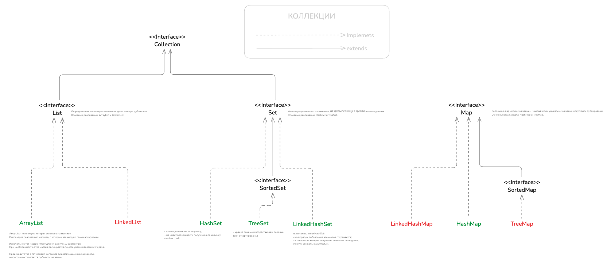

# Углубленное изучение коллекций

### Сначала пробежимся по всем коллекциям ->


# Какие бывают коллекции в Java? 

https://sky.pro/wiki/python/ponimaem-funktsiyu-enumerate-v-python-na-primere-koda/

Коллекции и списки позволяют хранить и управлять группами объектов, что делает код более организованным и эффективным.

Коллекции в Java включают в себя различные типы структур данных, 
такие как СПИСКИ, МНОЖЕСТВА и КАРТЫ. 
Каждый из этих типов имеет свои особенности и предназначен для решения различных задач:

- **List (списки)**
- **Set (множества)**
- **Map (карты)**


## Основные интерфейсы коллекций: List, Set, и Map

1. List (список). 

    Упорядоченная коллекция элементов, допускающая дубликаты. Основные реализации: ArrayList и LinkedList.

- могут содержить ДУБЛИКАТЫ
- позволяет хранить элементы в определенном ПОРЯДКЕ

___ 

2. Set (множество). 

    Коллекция уникальных элементов, не допускающая дублирование данных. Основные реализации: HashSet и TreeSet. 

- НЕ допускают ДУПЛИКАТОВ
- НЕ гарантируют ПОРЯДОК элементов

___

3. Map (карта). 

    Коллекция пар «ключ-значение». Каждый ключ уникален, значения могут быть дублированы. Основные реализации: HashMap и TreeMap.

- значения могут быть ДУБЛИРОВАНЫ
- позволяют хранить пары "ключ-значение" 
- и обеспечивают быстрый доступ к значениям по ключу.





## List

   Упорядоченная коллекция элементов, допускающая дубликаты. Основные реализации: ArrayList и LinkedList.

- могут содержить ДУБЛИКАТЫ
- позволяет хранить элементы в определенном ПОРЯДКЕ

Списки обеспечивают доступ к элементам по индексу, что делает их удобными для работы с последовательностями данных.

```java
public static void main(String[] args) {
   List<String> list = new ArrayList<>();
   list.add("Apple");
   list.add("Banana");
   list.add("Apple"); // Дубликаты разрешены

   for (String s : list) {
      System.out.println(s);
   }

   System.out.println();
   System.out.println(list.get(1));
}
```

Вывод:
```java
Apple
Banana
Apple

Banana
```

Списки предоставляют множество методов для работы с элементами, включая:
- добавление
- удаление
- поиск 
- и сортировку. 

Например:
- метод add — позволяет добавлять элементы в список
- метод remove — удалять элементы, 
- а метод contains — проверять наличие элемента в списке.

___


## Set

Интерфейс Set представляет собой коллекцию, которая не содержит дубликатов. 
Основные реализации включают HashSet и TreeSet. 

Множества обеспечивают быстрые операции: 
- добавления
- удаления 
- и поиска, 
- но не гарантируют порядок элементов.

```java
package org.collection.example2;

import java.util.HashSet;
import java.util.Set;

public class Start {

    public static void main(String[] args) {
        Set<String> set = new HashSet<>();
        set.add("Apple");
        set.add("Banana");
        set.add("Apple"); // Дубликаты не разрешены, "Apple" добавится только один раз

        for (String s : set) {
            System.out.println(s);
        }
    }

}

```

Вывод:
```java
Apple
Banana
```

Множества полезны в ситуациях, когда важно исключить дубликаты. 

Например, при хранении уникальных идентификаторов или при фильтрации повторяющихся элементов из списка.


___


## Map 

Интерфейс Map представляет собой коллекцию пар "ключ-значение". 
Основные реализации включают HashMap и TreeMap. 

Карты позволяют:
- быстро находить значения по ключу 
- и обеспечивают удобный способ хранения связанных данных


```java 
package org.collection.example2;

import java.util.HashMap;
import java.util.Map;

public class Start2 {

    public static void main(String[] args) {
        Map<String, Integer> map = new HashMap<>();
        map.put("Apple", 1);
        map.put("Banana", 2);
        map.put("Apple", 3); // Значение для ключа "Apple" будет обновлено

        for (String s : map.keySet()) {
            System.out.println(s + " " + map.get(s));
        }
    }

}
```

Вывод:
```java 
Apple 3
Banana 2
```

___
___

## Классы-реализации коллекций: ArrayList, LinkedList, HashSet, HashMap и др.

### ArrayList

ArrayList — это реализация интерфейса List, основанная на массиве.

```java
package org.collection.example1;

import java.util.ArrayList;
import java.util.List;

public class Start4 {

    public static void main(String[] args) {
        List<String> arrayList = new ArrayList<>();
        arrayList.add("Apple");
        arrayList.add("Banana");
        System.out.println(arrayList.get(0)); // Вывод: Apple

        System.out.println();
        for (String s : arrayList) {
            System.out.println(s);
        }
    }

}
```

Вывод:
```java
Apple

Apple
Banana
```

ArrayList является одним из наиболее часто используемых классов коллекций
- ПЛЮС: обеспечивает быстрый доступ к элементам по индексу
- МИНУС: операции вставки и удаления могут быть медленными (особенно при работе с большими объемами данных или в середине списка)


___

### LinkedList

LinkedList — это реализация интерфейса List, основанная на двусвязном списке. 

- МИНУС: доступ по индексу может быть медленным
- ПЛЮС: обеспечивает быстрые операции вставки и удаления

LinkedList подходит для сценариев, где важны частые изменения структуры списка.


LinkedList также поддерживает дополнительные методы - такие как добавление и удаление элементов с начала и конца списка, 
что делает его удобным для реализации очередей и стеков.

```java
package org.collection.example1;

import java.util.LinkedList;
import java.util.List;

public class Start5 {

   public static void main(String[] args) {
      List<String> linkedList = new LinkedList<>();
      linkedList.add("Apple");
      linkedList.add("Banana");
      System.out.println(linkedList.get(0)); // Вывод: Apple

      System.out.println();
      for (String s : linkedList) {
         System.out.println(s);
      }
   }

}

```

Вывод:
```java
Apple

Apple
Banana
```

___

### HashSet

HashSet — это реализация интерфейса Set, основанная на хэш-таблице. 

- ПЛЮСЫ: уникальность элементов
- ПЛЮСЫ: обеспечивает быстрые операции добавления, удаления и поиска, 
- МИНУСЫ: но не гарантирует порядок элементов. 

HashSet полезен для хранения уникальных элементов и быстрого выполнения операций проверки наличия.

HashSet является отличным выбором для задач, 
где важна уникальность элементов и не требуется сохранение порядка. 
Например, для хранения уникальных идентификаторов или фильтрации дубликатов.

```java
package org.collection.example1;

import java.util.HashSet;
import java.util.Set;

public class Start6 {

    public static void main(String[] args) {
        Set<String> hashSet = new HashSet<>();
        hashSet.add("Apple");
        hashSet.add("Banana");
        hashSet.add("Banana");
        System.out.println(hashSet.contains("Apple")); // Вывод: true

        System.out.println();
        for (String s : hashSet) {
            System.out.println(s);

        }
    }

}
```

Вывод: 
```java
true

Apple
Banana
```


___

### HashMap

HashMap — это реализация интерфейса Map, основанная на хэш-таблице. 

- ПЛЮСЫ: обеспечивает быстрые операции добавления, удаления и поиска по ключу.

HashMap широко используется для хранения и управления парами "ключ-значение".

HashMap предоставляет методы для работы с парами "ключ-значение", такие как:
- put
- get
- remove 
- и containsKey. 

Она является мощным инструментом для реализации различных структур данных и алгоритмов, 
требующих быстрого доступа к данным по ключу.

```java
package org.collection.example1;

import java.util.HashMap;
import java.util.Map;

public class Start7 {

    public static void main(String[] args) {
        Map<String, Integer> hashMap = new HashMap<>();
        hashMap.put("Apple", 1);
        hashMap.put("Banana", 2);
        System.out.println(hashMap.get("Apple")); // Вывод: 1

        System.out.println();
        for (String s : hashMap.keySet()) {
            System.out.println(s + " : " + hashMap.get(s));
        }
    }

}
```

Вывод:
```java
1

Apple : 1
Banana : 2
```

___
___
___

## Основные операции с коллекциями: добавление, удаление, поиск и итерация

### Добавление

Добавление элементов в коллекции осуществляется с помощью
- методов `add` для List и Set
- и метода `put` для Map. 

Эти методы позволяют динамически изменять содержимое коллекций:

```java
list.add("Cherry");
set.add("Cherry");
map.put("Cherry", 3);
```

Добавление элементов в коллекции является одной из наиболее часто выполняемых операций. 

Важно учитывать, что производительность этой операции может варьироваться в зависимости от типа коллекции 
и ее текущего состояния.


### Удаление

Удаление элементов из коллекций осуществляется с помощью методов `remove`. 

Эти методы позволяют удалять элементы по значению или по ключу, 
в зависимости от типа коллекции:

```java
list.remove("Banana");
set.remove("Banana");
map.remove("Banana");
```

Удаление элементов из коллекций может быть полезным для управления памятью и поддержания актуальности данных. 

Например, удаление устаревших записей из списка или карты.


### Поиск

Поиск элементов в коллекциях осуществляется с помощью методов:
- `contains` для List и Set
- `get` для Map

Эти методы позволяют проверять наличие элементов и получать значения по ключу:

```java
boolean containsApple = list.contains("Apple");
boolean containsBanana = set.contains("Banana");
Integer appleValue = map.get("Apple");
```

Поиск элементов в коллекциях является важной операцией для выполнения различных задач, 
таких как проверка наличия данных или извлечение значений по ключу. 

Эффективность поиска зависит от типа коллекции и ее реализации.


### Итерация

Итерация по элементам коллекций осуществляется с помощью циклов `for-each` или итераторов. 

Эти методы позволяют последовательно обрабатывать все элементы коллекции:

```java
for (String item : list) {
    System.out.println(item);
}

for (String item : set) {
    System.out.println(item);
}

for (Map.Entry<String, Integer> entry : map.entrySet()) {
    System.out.println(entry.getKey() + ": " + entry.getValue());
}
```

Итерация по коллекциям является важной частью работы с данными. 

Она позволяет выполнять различные операции над элементами коллекции, 
такие как вывод на экран, изменение значений или выполнение вычислений.


___
___


# Углубленное изучение коллекций


внутреннее устройство ArrayList

база: что такое ArrayL
принцип работы add и remove

ConcurrentModificationException

iterator

___


1. База: Что такое ArrayList

ArrayList – это динамический массив на базе стандартного массива, реализующий интерфейс List. Основные особенности:

- Хранит элементы в виде массива (Object), при этом размер может меняться динамически.
- Предоставляет быстрый доступ по индексу (через get и set), что дает сложность O(1).
- При добавлении элементов может потребоваться расширение внутреннего массива, что приводит к затратам на копирование.
- Не синхронизирован, поэтому при работе в многопоточной среде требуется дополнительная синхронизация.

Простой пример создания и работы с ArrayList:

```java
import java.util.ArrayList;
import java.util.List;

public class ArrayListExample {
    public static void main(String args) {
        List<String> fruits = new ArrayList<>();
        fruits.add("Яблоко");
        fruits.add("Банан");
        fruits.add("Апельсин");

        // Обход с использованием цикла for
        for (int i = 0; i < fruits.size(); i++) {
            System.out.println(fruits.get(i));
        }
    }
}
```
___

2. Принцип работы add и remove

Метод add:
- При вызове add(value) элемент добавляется в конец списка.
- Если внутренний массив заполнен, ArrayList создает новый массив с большим размером (обычно увеличивая емкость примерно на 50% — точная стратегия зависит от реализации) и копирует старые элементы.
- Сложность добавления в конец – амортизированная O(1), но если происходит перераспределение – временные затраты возрастают.

Метод remove:
- При вызове remove(index) удаляется элемент по указанному индексу.
- После удаления производится сдвиг всех последующих элементов на одну позицию влево, чтобы «заполнить пробел».
- Это сдвигиная операция имеет сложность O(n) в худшем случае, особенно при удалении элемента в начале списка.
- Алгоритм также обновляет переменную modCount, которая отвечает за контроль модификаций коллекции (используется итераторами).


```java
import java.util.ArrayList;

public class ArrayListAddRemove {
    public static void main(String args) {
        ArrayList<Integer> numbers = new ArrayList<>();
        // Добавление элементов
        numbers.add(1);
        numbers.add(2);
        numbers.add(3);
        System.out.println("Список после добавления: " + numbers);

        // Удаление элемента по индексу 1 (элемент 2)
        numbers.remove(1);
        System.out.println("Список после удаления элемента по индексу 1: " + numbers);
    }
}
```

___


3. ConcurrentModificationException

ConcurrentModificationException – это исключение, которое выбрасывается в случае,
когда коллекция была модифицирована структурно (то есть добавлены или удалены элементы),
кроме как через методы итератора, во время итерации. Это связано с так называемым принципом «fail-fast».

Как это работает:
- ArrayList содержит переменную modCount, которая увеличивается при каждой структурной модификации.
- Итератор при создании сохраняет значение modCount.
- Перед каждой операцией next() итератор проверяет, что значение modCount не изменилось.
  Если обнаруживается разница, то выбрасывается ConcurrentModificationException.


```java
import java.util.ArrayList;
import java.util.Iterator;

public class ConcurrentModificationExample {
    public static void main(String args) {
        ArrayList<String> list = new ArrayList<>();
        list.add("A");
        list.add("B");
        list.add("C");

        try {
            for (String item : list) {
                // Попытка модификации коллекции во время итерации
                if ("B".equals(item)) {
                    list.remove(item); // Это вызовет ConcurrentModificationException
                }
            }
        } catch (ConcurrentModificationException e) {
            System.out.println("Исключение: " + e);
        }
    }
}


```


Рекомендации для безопасного удаления элементов во время итерации:
- Использовать метод remove() итератора.
- Либо копировать коллекцию в новый список и работать с ней.

Пример безопасного удаления:


```java
import java.util.ArrayList;
import java.util.Iterator;

public class SafeRemoveExample {
    public static void main(String args) {
        ArrayList<String> list = new ArrayList<>();
        list.add("A");
        list.add("B");
        list.add("C");

        Iterator<String> it = list.iterator();
        while (it.hasNext()) {
            String item = it.next();
            if ("B".equals(item)) {
                it.remove(); // Безопасное удаление через итератор
            }
        }

        System.out.println("Список после безопасного удаления: " + list);
    }
}
```


___

4. Iterator

Iterator – это объект, предоставляющий способ последовательного обхода элементов коллекции. Он поддерживает методы:
- hasNext() – проверяет, есть ли следующий элемент;
- next() – возвращает следующий элемент;
- remove() – удаляет текущий элемент, на который указывает итератор, предотвращая возникновение ConcurrentModificationException при корректном использовании.

Некоторые моменты:
- Итераторы реализуют fail-fast механизм, как описано выше, поэтому любые структурные изменения вне итератора могут вызвать исключение.
- Итератор позволяет абстрагироваться от внутренней структуры коллекции и работает как универсальный интерфейс для обхода.

Пример использования итератора для обхода коллекции:


```java
import java.util.ArrayList;
import java.util.Iterator;

public class IteratorExample {
    public static void main(String args) {
        ArrayList<String> list = new ArrayList<>();
        list.add("Первый");
        list.add("Второй");
        list.add("Третий");

        // Использование итератора для обхода элементов
        Iterator<String> iterator = list.iterator();
        while (iterator.hasNext()) {
            String element = iterator.next();
            System.out.println(element);
        }
    }
}
```


Важно: Итератор позволяет корректно выполнять операции удаления с использованием метода remove(),
который обновляет внутреннее состояние итератора и коллекции, избегая конфликтов с modCount.


Вывод

Изучая углубленно коллекции в Java, необходимо понимать:
- Внутреннюю структуру таких классов, как ArrayList, и как они реализуют динамические массивы.
- Как работают методы add (с динамическим расширением) и remove (сдвиг элементов и обновлением modCount).
- Почему возникает ConcurrentModificationException и как избежать ошибок при изменении коллекции во время итерации.
- Роль итератора в обходе коллекций, его fail-fast поведение и возможности безопасного удаления элементов.

Эти концепции являются основой для эффективной работы с коллекциями в Java и понимания их внутренней реализации,
что особенно полезно при оптимизации производительности и разработке потокобезопасного кода.


___
___
___

