https://skillbox.ru/media/base/isklyucheniya_v_java_chast_1/

https://skillbox.ru/media/base/isklyucheniya-v-java-chast-2/

# Исключения в Java (Exception)

Код вашей программы исправно компилируется и запускается, 
только вот вместо желанного результата вы видите непонятный текст. 

За примером далеко ходить не надо: сделаем то, 
что нам запрещали ещё в школе, — поделим на ноль.

```java
public static void main(String[] args) {
    hereWillBeTrouble(42, 0);
}

public static void hereWillBeTrouble(int a, int b) {
    int oops = a / b;
    System.out.println(oops);
}
```

Получим:

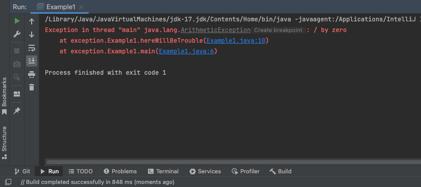

Это и есть исключение.

«Исключение» — сокращение от слов «исключительный случай». 

Это ситуация, в которой:
- программа не может продолжить работу 
- или её работа становится бессмысленной.


- причём речь не только о нештатных ситуациях 
- исключения бывают и намеренными, такие разработчик вызывает сам.


Исключения в Java появились уже в первой версии языка.
А вот в языках, где их нет, вместо них возвращают коды ошибок.


## Иерархия исключений и ошибки

- у всех классов исключений есть общий класс-предок Throwable, 
- от него наследуются классы Error и Exception, базовые для всех прочих

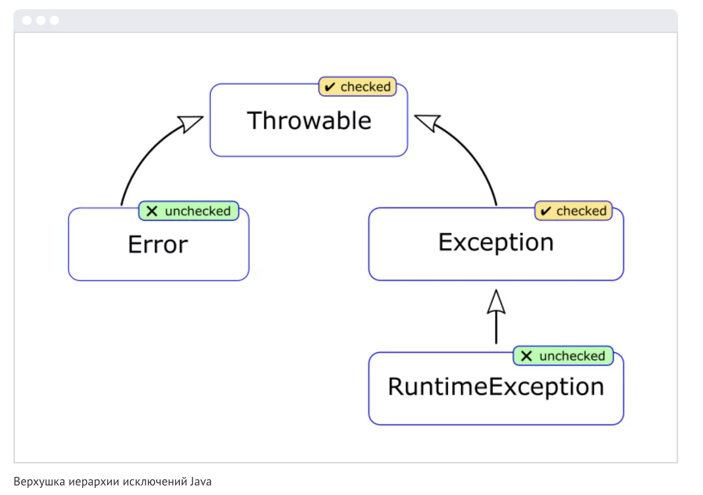


### Что такое ошибки (Errors)

Error — это критические условия, 
в которых работа программы должна быть завершена. 

Например, 
- когда при выполнении программы закончилась память, 
- произошёл сбой в системе 
- или виртуальной машине. 

Не будем задерживаться на этой ветке, поскольку документация Java говорит:

```Error is the superclass of all the exceptions from which ordinary programs are not ordinarily expected to recover.```

Что в переводе означает: 

Ошибки (Error) — это такие исключительные ситуации, 
в которых восстанавливать работу программы не предполагается.

То есть это проблемы, которые нельзя (недопустимо) исправлять на ходу. 

Всё, что нам остаётся, — извиниться перед пользователем 
и впредь писать программы, где возникнет меньше подобных ситуаций. Например, не допускать такой глубокой рекурсии, как в коде ниже:

```java
static void notGood() {
    System.out.println("Только не снова!");
    notGood();
}
```

Вывод:

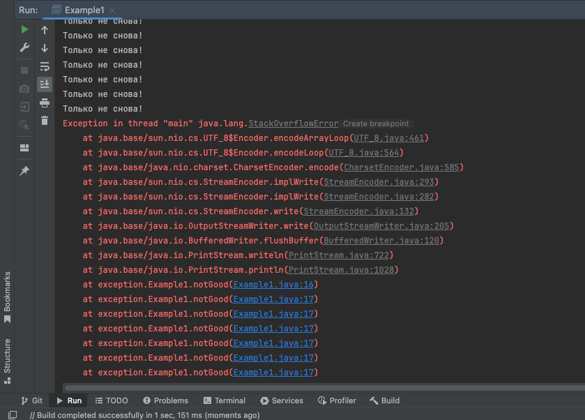

При работе этого метода у нас возникнет ошибка: 

Exception in thread «main» java.lang.StackOverflowError 
— стек вызовов переполнился, так как мы не указали условие выхода из рекурсии.


### Что такое исключения (Exceptions)

А теперь об Exception. 

Эти исключительные ситуации возникают, 
1. если разработчик допустил невыполнимую операцию, 
2. не предусмотрел особые случаи в бизнес-логике программы 
(или сообщает о них с помощью исключений).
___


    1. Невыполнимая операция

Мир не рухнул, как в случае с Error, просто Java не знает, что делать дальше. 

Как раз из этого разряда деление на ноль в начале статьи:
- и правда, какое значение тогда присвоить переменной oops?
- (убедитесь сами, что исключение класса ArithmeticException наследуется
как раз от Exception)

Другая частая ситуация — обращение к несуществующему элементу массива. 
- например, у нас в нём десять элементов, 
- а мы пытаемся обратиться к одиннадцатому.

___


    2. Особый случай в бизнес-логике программы

Классика. 

Программируем задачу о перевозке волка, козы и капусты через реку: 
- в лодке может быть только два пассажира, 
- но волка с козой и козу с капустой нельзя оставлять на берегу вместе. 

Это и есть особый случай в бизнес-логике, который нельзя нарушать.

__

Или пользователь вводит:
- дату начала некоторого периода 
- и дату его окончания. 

Вторая дата не может быть раньше первой.

__

Или, допустим:
- У нас есть метод, который читает файл. 
- Сам метод написан верно. 
- Пользователь передал в него корректный путь. 
- Только вот у этого работника нет права читать этот файл 
(его роль и права обусловлены предметной областью). 

Что же тогда методу возвращать? 

Вернуть-то нечего, ведь метод не отработал. 

Самое очевидное решение — выдать исключение.


# Что делать с исключениями

1. Простейший вариант — ничего; 

Возникает исключение — программа просто прекращает работать.

Чтобы убедиться в этом, выполним код:

```java
public static void main(String[] args) {
    hereWillBeTrouble(42, 0);
}

public static void hereWillBeTrouble(int a, int b) {
    System.out.println("Всё, что было до...");
    int oops = a / b;
    System.out.println(oops);
    System.out.println("Всё, что будет после...");
}
```

Вывод:

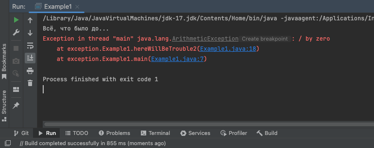


Так и есть: до деления на ноль код выполнялся, а после — нет.


    Это интересно: 
    
    Когда возникает исключение, 
    программисты выдают что-то вроде: 
    - «код [вы]бросил исключение» 
    - или «код кинул исключение»
    
    А глагол таков потому, что все исключения — наследники класса Throwable, 
    что значит «бросаемый» / «который можно бросить».


___

2. Второе, что можно делать с исключениями, — это их обрабатывать.

Для этого нужно:
- заключить кусок кода, 
- который может вызвать исключение, 
- в конструкцию try-catch.

Как это работает: 
- если в блоке try возникает исключение, 
- которое указано в блоке catch, 
- то исполнение блока try прервётся и выполнится код из блока catch.

Например:

```java
public static void main(String[] args) {
    hereWillBeTrouble();
}

private static void hereWillBeTrouble(int a, int b) {
    int oops;
    try {
        System.out.println("Всё, что было до...");
        oops = a / b;
        System.out.println(oops);
        System.out.println("Всё, что будет после...");
    } catch (ArithmeticException e) {
        System.out.println("Говорили же не делить на ноль!");
        oops = 0;
    }
    System.out.println("Метод отработал");
}
```


Разберём этот код.

Если блок try кинет исключение ArithmeticException, 
- то управление перехватит блок catch, 
- который выведет строку «Говорили же не делить на ноль!», 
- а значение oops станет равным 0.

После этого программа продолжит работать как ни в чём не бывало: 
- выполнится код после блока try-catch, 
- который сообщит: «Метод отработал».

Проверьте сами: запустите код выше. 
- Вызовите метод hereWillBeTrouble 
- с любыми значениями аргументов кроме нулевого b. 


- Если в блоке try не возникнет исключений, 
- то его код выполнится целиком, 
- а в блок catch мы даже не попадём:

```java
Всё, что было до...
Говорили же не делить на ноль!
Метод отработал

Process finished with exit code 0
```


___

3. Есть ещё и третий вариант — пробросить исключение наверх. Но об этом в следующей статье.


## Как читать исключение

Вернёмся к первой картинке. 

Посмотрим, что нам сказала Java, когда произошло исключение:


Начинаем разбирать сверху вниз:

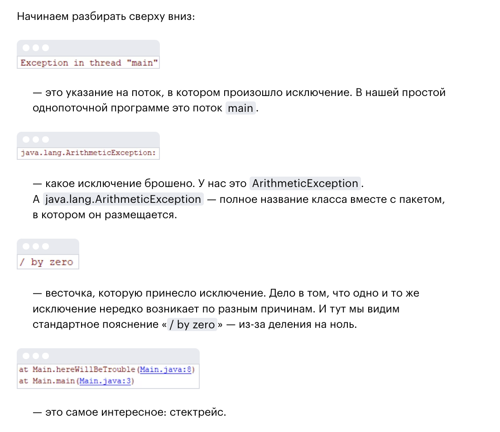

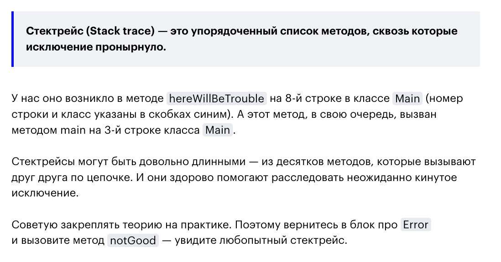


## Как создать исключение

Всё это время мы имели дело с исключением, 
которое бросает Java-машина — при делении на ноль. 
Но как вызвать исключение самим?

Раз исключение — это объект класса, то программисту всего-то и нужно, 
- что создать объект с нужным классом исключения 
- и бросить его с помощью оператора throw:

```java
public static void main(String[] args) {
    hereWillBeTrouble(42, 0);
}

private static void hereWillBeTrouble(int a, int b) {
    if (b == 0) {
        throw new ArithmeticException("ты опять делишь на ноль?");
    }
    int oops = a / b;
    System.out.println(oops);
}
```

При создании большинства исключений 
- первым параметром в конструктор можно передать сообщение 
- мы как раз сделали так выше

А получим мы то же самое, что и в самом первом примере, 
- только вместо стандартной фразы «/by zero» 
- теперь выдаётся наш вопрос-пояснение «ты опять делишь на ноль?»:

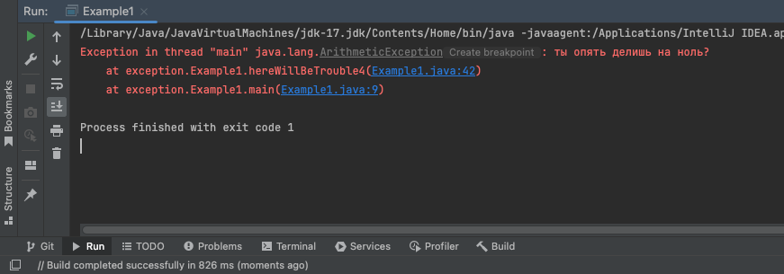


### Что дальше
Узнаем про их разделение 
- на checked 
- и unchecked, 
- а также о том, что ещё интересного можно с ними делать.


# Проброс исключений

Ранее мы рассказали, 
- что все исключения в Java — это классы, наследники Throwable и Exception; 
- мельком взглянули на класс Error, 
от которого наследуются ошибки уровня Java-машины.

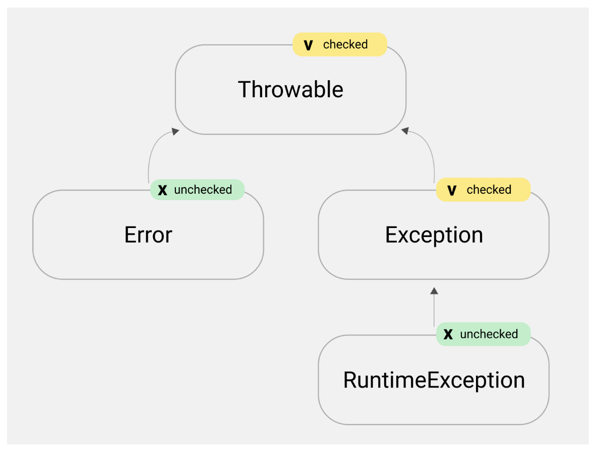


Поговорим только про семейство Exception.

В Java много встроенных исключений. 

На каждом останавливаться не будем: вы и так познакомитесь с ними на практике. Сейчас важнее до конца уяснить, как с исключениями работать.

Напомню, что есть три способа обойтись с исключением:

1. Ничего не делать.
2. Обработать в конструкции try-catch.
3. Пробросить наверх.

С первыми двумя мы разбирались здесь. Остался проброс исключений наверх.

Наверх — это куда? Это выше по стеку вызовов. То есть:
- если метод A вызвал метод B, 
- метод B вызвал метод C, 
- а метод C пробросил исключение наверх, 
- то оно всплывёт до метода B — и станет его проблемой.


## Как пробросить исключение?

Проще простого.

Вернёмся к примеру из предыдущей статьи. 

Помните, там был метод hereWillBeTrouble, который мог вызвать исключение ArithmeticException?

Чтобы пробросить это исключение, 
- достаточно добавить в сигнатуру метода hereWillBeTrouble ключевое слово throws, 
- а после него — название класса пробрасываемого исключения.

Вот так:

```java
public static void main(String[] args) {
    hereWillBeTrouble();
}

private static void hereWillBeTrouble() throws ArithmeticException {
    System.out.println("Всё, что было до...");
    int oops = 42 / 0;
    System.out.println("Всё, что будет после...");
}
```

Вывод:

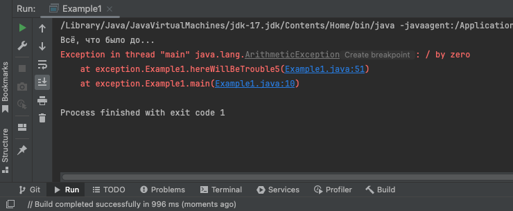


Дополнение:

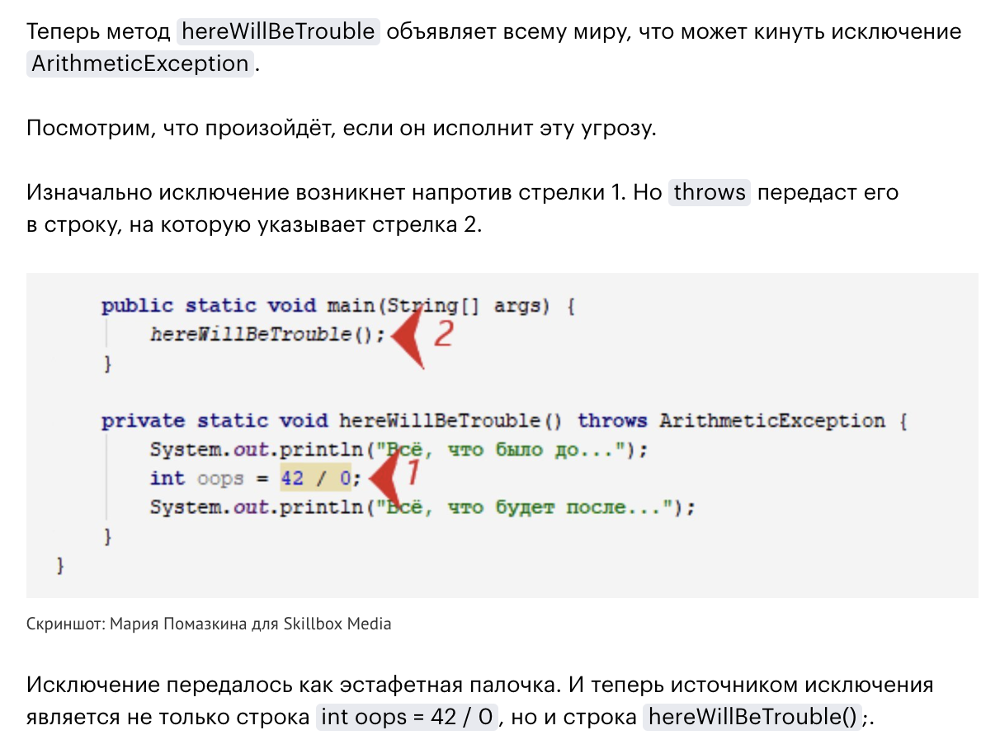


Что нам дал проброс исключения?

1. Так мы говорим разработчику, который вызывает метод hereWillBeTrouble, 
что в нём может возникнуть исключение типа ArithmeticException.


2. В вызывающем метод hereWillBeTrouble коде это исключение можно обработать с помощью конструкции try-catch.


```java
public static void main(String[] args) {
    try {
        hereWillBeTrouble();
    } catch (ArithmeticException ex) {
        System.out.println("Да, это случилось");
    }
}

private static void hereWillBeTrouble() throws ArithmeticException {
    System.out.println("Всё, что было до...");
    int oops = 42 / 0;
    System.out.println("Всё, что будет после...");
}
```

Вывод:

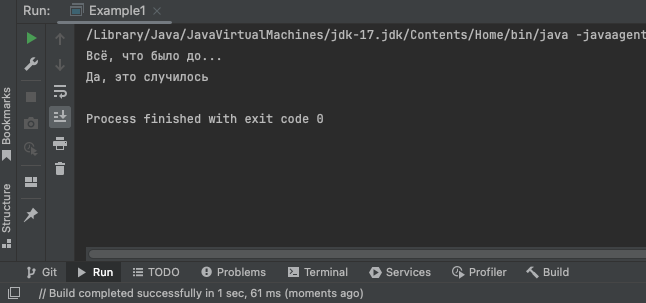

Вернёмся к первому блоку кода (в котором нет конструкции try-catch).

Вы наверняка заметили, 
- что и без throws код работал точно так же. 
- стектрейс не изменился, исключение в итоге бросалось пользователю.

Но теперь разработчики, которые используют метод hereWillBeTrouble, предупреждены и, если нужно, обезопасят свой код с помощью try-catch.

И это всё, что дало слово throws?

В случае с непроверяемыми исключениями — да. Но вот в случае с проверяемыми… пристегнитесь, нас ждёт новый поворот в деле об исключениях!


# Проверяемые и непроверяемые исключения


Все исключения в Java делятся на две группы:
- checked («проверяемые») / «обрабатываемые»
- и unchecked (и «непроверяемые») / «необрабатываемые»


    Запомните! 
    Проверяемые исключения обязательно нужно обрабатывать либо пробрасывать. 
    Непроверяемые — по желанию.


### Как понять, проверяемое исключение или нет?

Разработчики языка Java решили так:
- исключения, которые наследуются от RuntimeException, — непроверяемые,
- а все остальные — проверяемые


Исследуем различия на практике:

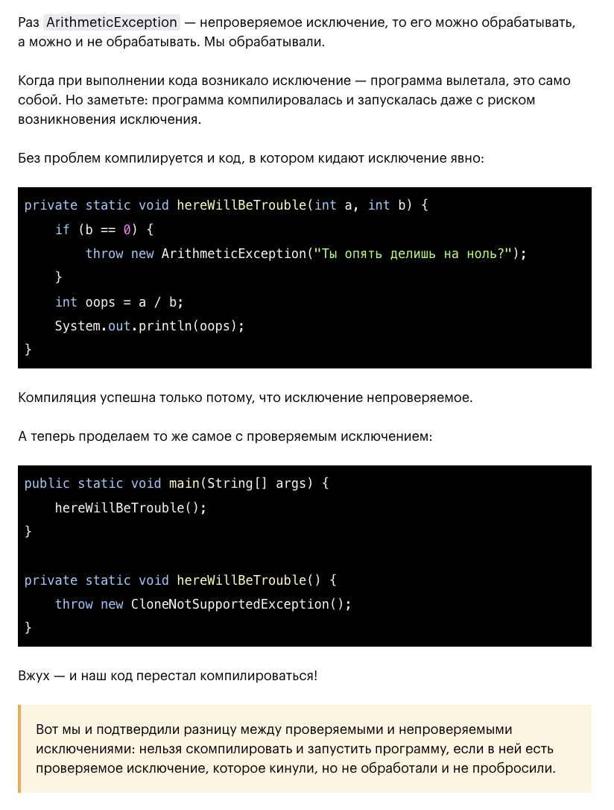

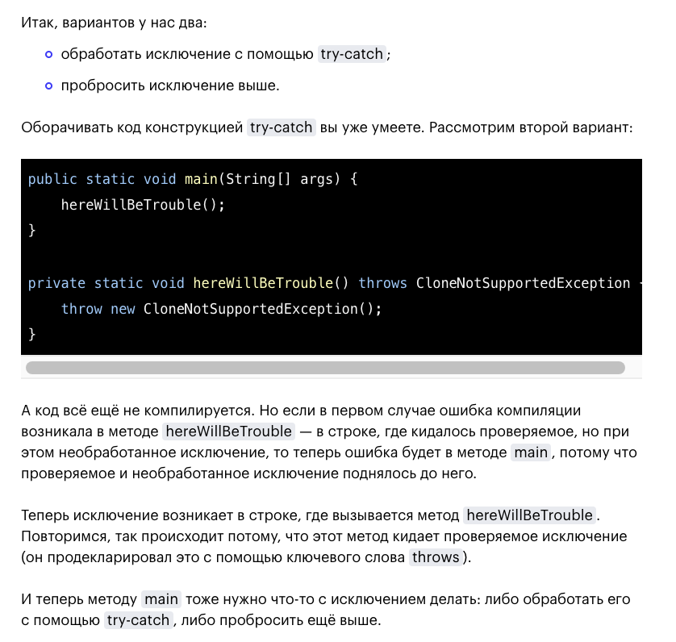
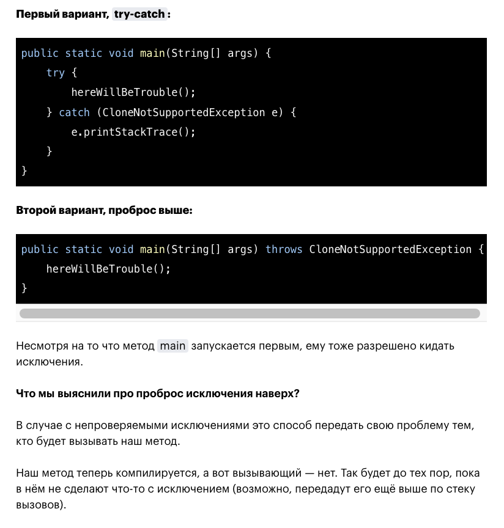

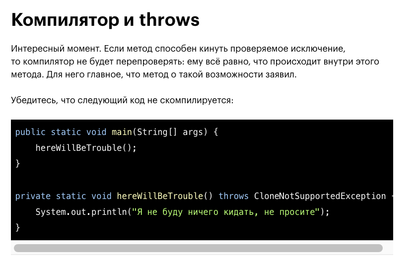
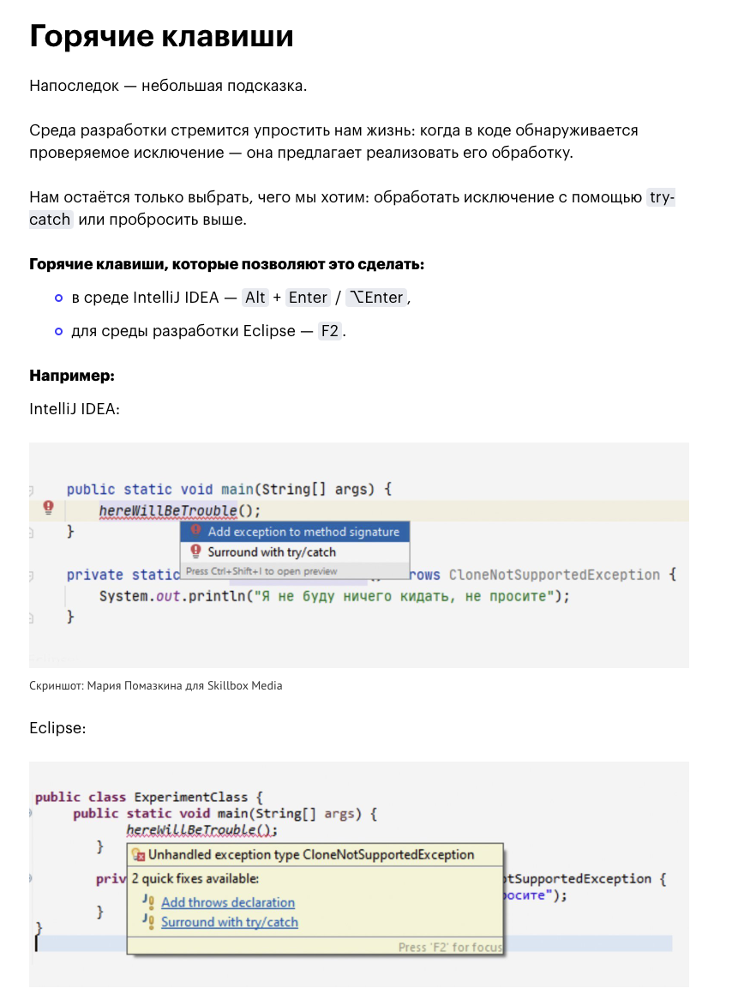


# Пример 1

либо

```java
public class Task1 {

    /**
     * Перехватите исключение (и вывести его на экран)
     * указав его тип, возникающее при выполнении кода:
     * int a = 42/0
     */
    public static void main(String[] args) {
        testMethod(42, 0);
    }

    public static void testMethod(int a, int b) {
        int c;
        //c = a / b;  //пример без try catch: Exception in thread "main" java.lang.ArithmeticException: / by zero
        try {
            System.out.println("Все, что было до...");
            c = a / b;
            System.out.println(c);
            System.out.println("Все, что будет после...");
        } catch (ArithmeticException e) {
            System.out.println("Говорили же не делить на ноль! Попали на ArithmeticException!");
            c = 0;
        }
        System.out.println("Метод отработал");
        System.out.println("Переменная c = " + c);
    }

}
```

Вывод:
```java
Все, что было до...
Говорили же не делить на ноль! Попали на ArithmeticException!
Метод отработал
Переменная c = 0

Process finished with exit code 0
```


# Пример 2

```java
public class Task2 {

    /**
     * Перехватить исключение (и вывести его на экран)
     * указав его тип, возникающее при выполнении кода:
     * String s = null
     * String m = s.toLowerCase();
     */
    public static void main(String[] args) {
        String s = null;
        String m = s;
        testMethod(s, m);
    }

    public static void testMethod(String s, String m) {
        //m = s.toLowerCase();      //пример без try catch: Exception in thread "main" java.lang.NullPointerException: Cannot invoke "String.toLowerCase()" because "s" is null
        try {
            System.out.println("Все, что было до...");
            m = s.toLowerCase();
            System.out.println(m);
            System.out.println("Все, что будет после...");
        } catch (NullPointerException e) {
            System.out.println("null не привести к toLowerCase, добрый вечер, NullPointerException");
            m = null;
        }
        System.out.println("Метод отработал");
        System.out.println("Переменная m = " + m);
    }

}
```

Вывод:
```java
Все, что было до...
        null не привести к toLowerCase, добрый вечер, NullPointerException
Метод отработал
Переменная m = null

Process finished with exit code 0
```


# Пример 3

```java
public class Task3 {

    /**
     * Перехватить исключение (и вывести его на экран)
     * указав его тип, возникающее при выполнении кода:
     * int[] m = new int[2];
     * m[8] = 5;
     */
    public static void main(String[] args) {
        int[] m = new int[2];
        testMethod(m, 8, 5);
    }

    public static void testMethod(int[] m, int placeInArray, int number) {
        //m[placeInArray] = number;     //пример без try catch: Exception in thread "main" java.lang.ArrayIndexOutOfBoundsException: Index 8 out of bounds for length 2
        try {
            System.out.println("Все, что было до...");
            m[placeInArray] = number;
            System.out.println(m);
            System.out.println("Все, что будет после...");
        } catch (ArrayIndexOutOfBoundsException e) {
            System.out.println("За размером следи, у тебя же ArrayIndexOutOfBoundsException");
            System.out.println("Так и быть, помогу, запишу в последнюю ячейку массива");
            System.out.println("До присваивания = " + m[m.length-1]);
            m[m.length-1] = number;
            System.out.println("После присваивания = " + m[m.length-1]);
        }
    }

}
```

Вывод:
```java
Все, что было до...
За размером следи, у тебя же ArrayIndexOutOfBoundsException
Так и быть, помогу, запишу в последнюю ячейку массива
До присваивания = 0
После присваивания = 5

Process finished with exit code 0
```


# Пример 4

```java
public class Task4 {

    /**
     * Перехватить исключение (и вывести его на экран)
     * указав его тип, возникающее при выполнении кода:
     * ArrayList<String> list = new ArrayList<String>();
     * String s = list.get(18);
     */
    public static void main(String[] args) {
        ArrayList<String> list = new ArrayList<String>();
        testMethod(list, 18);
    }

    public static void testMethod(ArrayList<String> list, int placeInArrayList) {
        //String es = list.get(placeInArrayList);      //пример без try catch: Exception in thread "main" java.lang.IndexOutOfBoundsException: Index 18 out of bounds for length 0
        try {
            System.out.println("Все, что было до...");
            String s = list.get(placeInArrayList);
            System.out.println(s);
            System.out.println("Все, что будет после...");
        } catch (IndexOutOfBoundsException e) {
            System.out.println("За размером следи, у тебя же IndexOutOfBoundsException");
            System.out.println("list.size() = " + list.size());
        }
    }

}
```

Вывод:
```java
Все, что было до...
За размером следи, у тебя же IndexOutOfBoundsException
list.size() = 0

Process finished with exit code 0
```


# Пример 5

Сделаем намеренно неверный логин

```java
public class Task5 {

    /**
     * создайте статический метод, который принимает на вход три параметра: login, password, confirmPassword
     *
     * login треб1:      должен содержать только латинские буквы, цифры и знак подчеркивания
     * login треб2:      длина должна быть меньше 20 символов
     * login если не соотв треб1-2:      выбросить WrongLoginException (создать самостоятельно)
     *
     * password треб 1:  должен содержать только латинские буквы, цифры и знак подчеркивания
     * password треб 2:  длина должна быть меньше 20 символов
     * password если не соотв треб1-2:   выбросить WrongPasswordException (создать самостоятельно)
     *
     * WrongLoginException и WrongPasswordException: пользовательские классы исключения с двумя конструкторами:
     * один по умолчанию
     * второй принимает сообщение исключения и передает его в конструктор класса Exception
     *
     * обработка исключений проводится внутри метода
     * используйте multi-catch-block
     *
     * метод возвращает true, если значения верны
     * или false в ином случае
     */
    public static void main(String[] args) {
        System.out.println("тест1:");
        System.out.println(checkMethod("skufarev05_", "12password9", "12password9"));
        System.out.println();

        System.out.println("тест2:");
        System.out.println(checkMethod("skufarev05_", "12password9!", "12password9"));
        System.out.println();

        System.out.println("тест3:");
        System.out.println(checkMethod("skufarev05_!", "12password9", "12password9"));
    }

    public static boolean checkMethod(String login, String password, String confirmPassword) {
        
        //отдельно наброски по каждому условию
        //LOGIN
        //треб1: должен содержать только латинские буквы, цифры и знак подчеркивания
        /*boolean onlyLatinAlphabet = login.matches("^[a-zA-Z0-9_]+$");
        System.out.println(onlyLatinAlphabet);
        return onlyLatinAlphabet;*/

        //треб2: длина не менее 20 символов
        /*if (login.length() < 20) {
            System.out.println("true");
            return true;
        } else {
            System.out.println("false");
            return false;
        }*/

        //PASSWORD
        //треб1: должен содержать только латинские буквы, цифры и знак подчеркивания
        /*boolean onlyLatinAlphabet = password.matches("^[a-zA-Z0-9_]+$");
        System.out.println(onlyLatinAlphabet);
        return onlyLatinAlphabet;*/

        //треб2: длина не менее 20 символов
        /*if (password.length() < 20) {
            System.out.println("true");
            return true;
        } else {
            System.out.println("false");
            return false;
        }*/

        //треб3: пароли должны совпадать
        /*if (password.equals(confirmPassword)) {
            System.out.println("true");
            return true;
        } else {
            System.out.println("false");
            return false;
        }*/

        try {
            validateLogin(login);
            validatePassword(password, confirmPassword);
        } catch (WrongLoginException e) {
            throw new WrongLoginException("Wrong login!!!");
        } catch (WrongPasswordException e) {
            throw new WrongLoginException("Wrong password!!!");
        }

        return true;
    }

    public static void validateLogin(String login) throws WrongLoginException {
        boolean onlyLatinAlphabet = login.matches("^[a-zA-Z0-9_]+$");
        if (!onlyLatinAlphabet) {
            throw new WrongLoginException("Wrong login - только лат буквы, цифры, нижн подчеркивания");
        }
        if (login.length() > 20) {
            throw new WrongLoginException("Wrong login - длина логина должна быть не менее 20 символов");
        }
    }

    public static void validatePassword(String password, String confirmPassword) throws WrongPasswordException {
        boolean onlyLatinAlphabet = password.matches("^[a-zA-Z0-9_]+$");
        if (!onlyLatinAlphabet) {
            throw new WrongPasswordException("Wrong password - только лат буквы, цифры, нижн подчеркивания");
        }
        if (password.length() > 20) {
            throw new WrongPasswordException("Wrong password - длина пароля должна быть не менее 20 символов");
        }
        if (!password.equals(confirmPassword)) {
            throw new WrongPasswordException("Wrong password - пароли не совпадают");
        }
    }

}
```

```java
public class WrongLoginException extends RuntimeException {

    WrongLoginException() {
        super();
    }

    WrongLoginException(String message) {
        super(message);
    }

}
```

```java
public class WrongPasswordException extends RuntimeException {

    WrongPasswordException() {
        super();
    }

    WrongPasswordException(String message) {
        super(message);
    }

}
```

Вывод:
```java
тест1:
        true

тест2:
Exception in thread "main" exception.task5.WrongLoginException: Wrong password!!!
at exception.task5.Task5.checkMethod(Task5.java:87)
at exception.task5.Task5.main(Task5.java:32)

Process finished with exit code 1

[или пример тест3]:
Exception in thread "main" exception.task5.WrongLoginException: Wrong login!!!
at exception.task5.Task5.checkMethod(Task5.java:85)
at exception.task5.Task5.main(Task5.java:36)

Process finished with exit code 1
```
=======

Исключительные ситуации, требующие обработки:
- не найден счет при переводе               //просто обрабатывать NullPointer (tryCatch)
- не найден пользователь при переводе       //просто обрабатывать NullPointer (tryCatch)
- недостаточно средств на счете             //генерить исключение

___
___
___

```java

```


