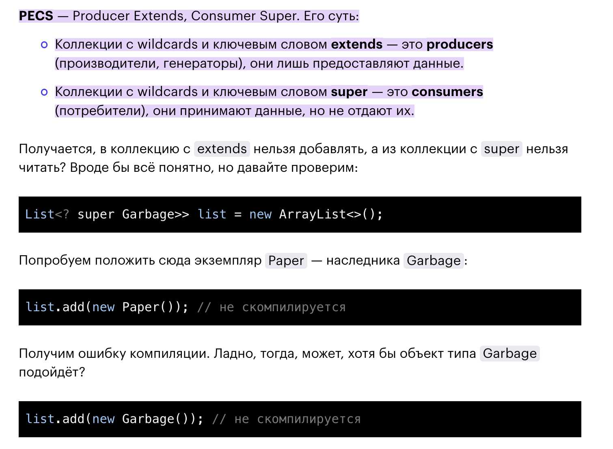
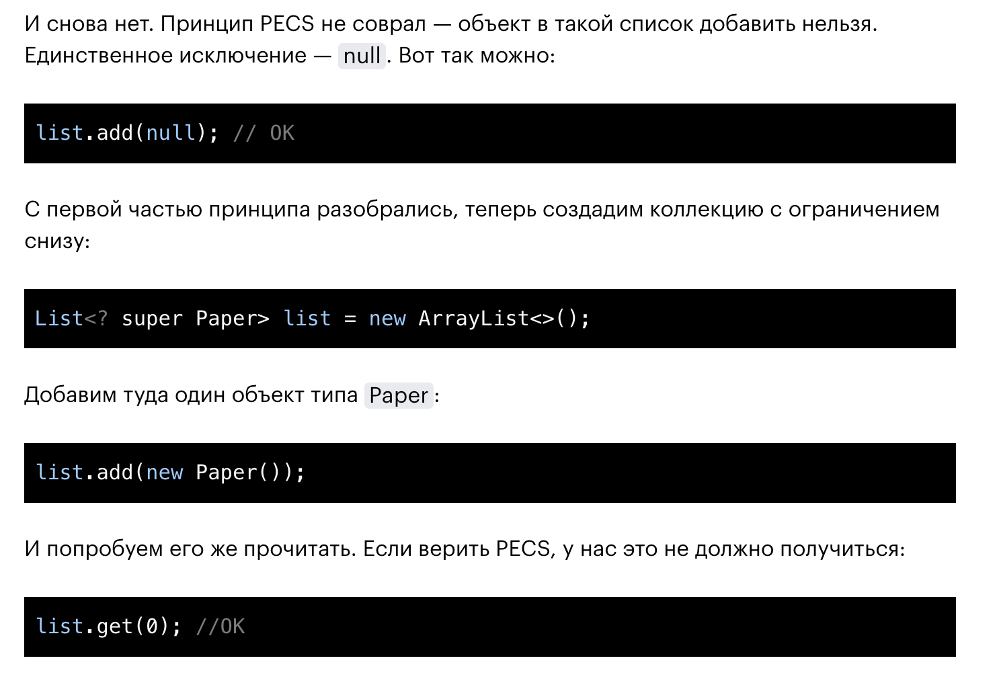
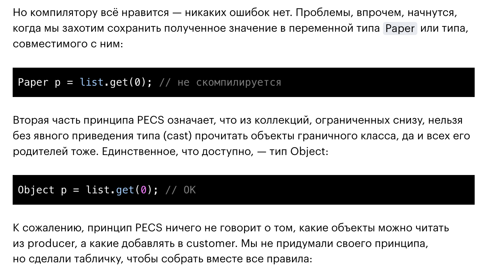
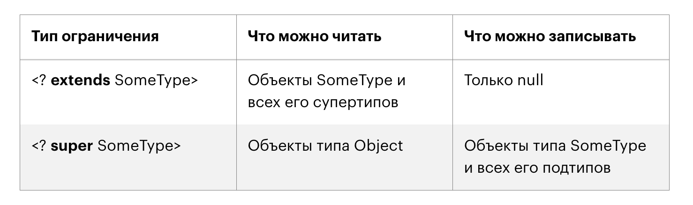
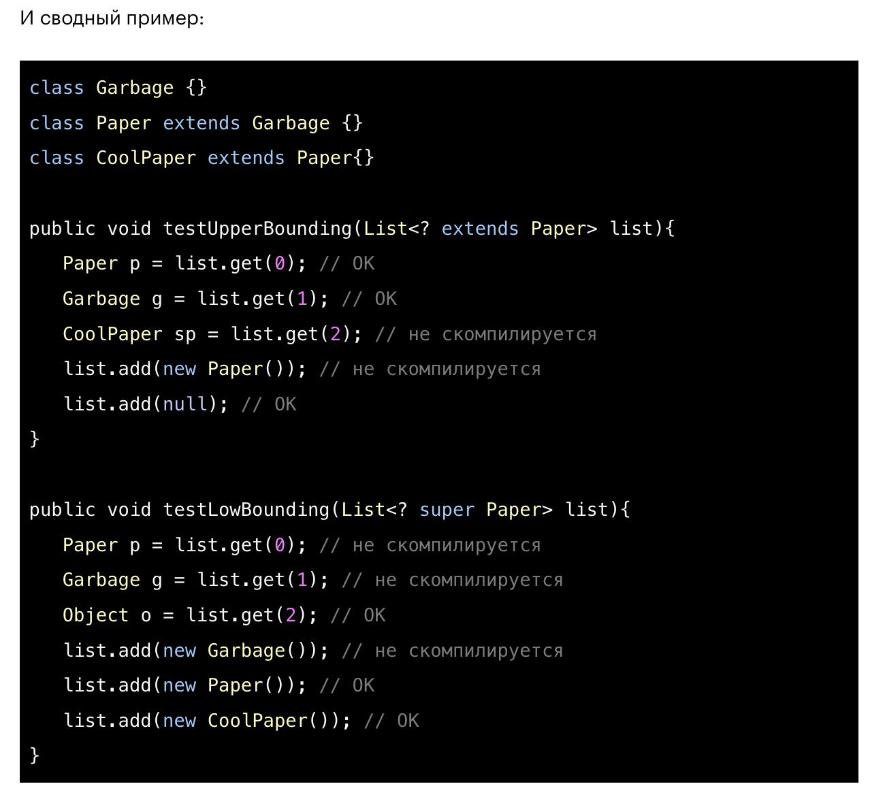
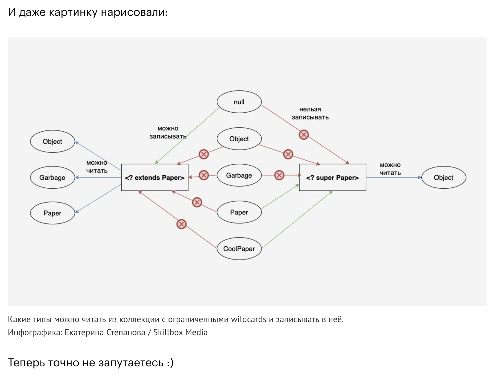

# PECS (продолжение Обобщения (Generic)

Если нужно что-то сделать с коллекциями объектов нескольких подтипов, 
удобны wildcards с ограничениями.

Например: 

```java
List<? extends Paper>
```

- означает, что список может состоять из объектов типа Paper и всех его подтипов, 

___ 

```java
List<? super Paper>
```

- а тут могут быть объекты типа Paper и всех супертипов — например, Garbage или Object.

___

С wildcards и коллекциями есть маленькая проблема:

- Коллекции вроде тех, что в примере выше, нельзя использовать на полную катушку: 
- - свободно читать из них 
- - и записывать новые данные. 

Чтобы запомнить это ограничение, даже придумали принцип — принцип PECS.














