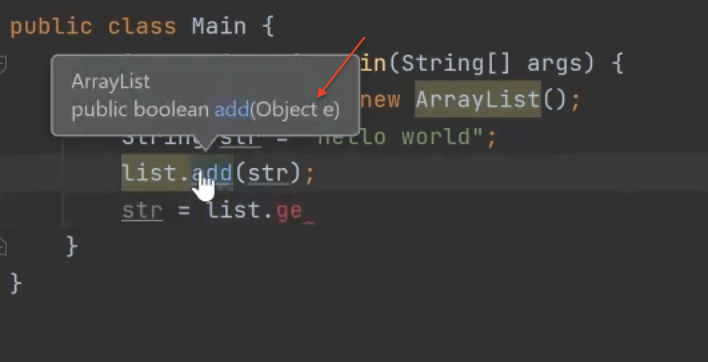
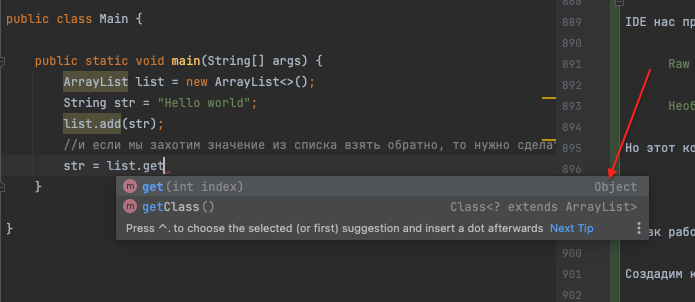
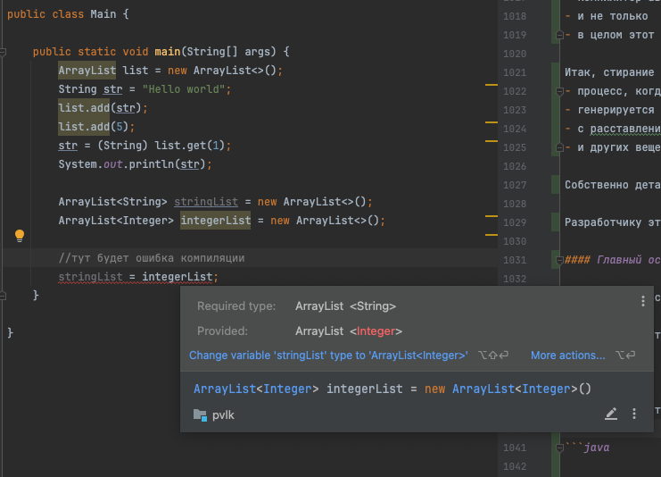
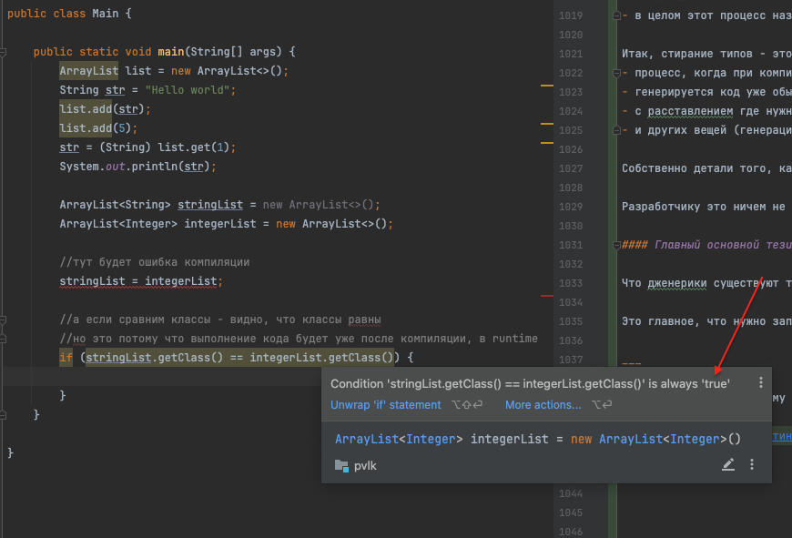
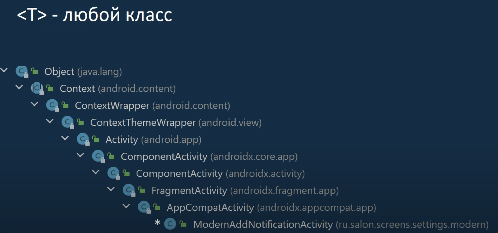
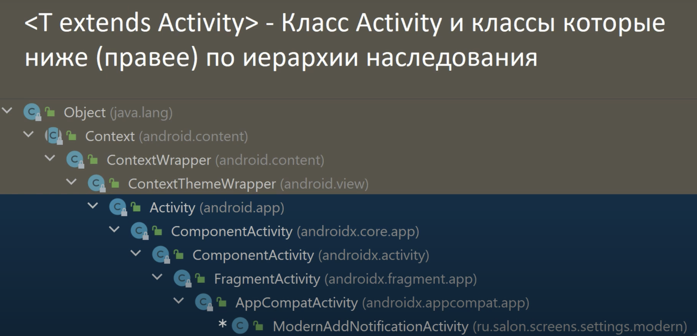
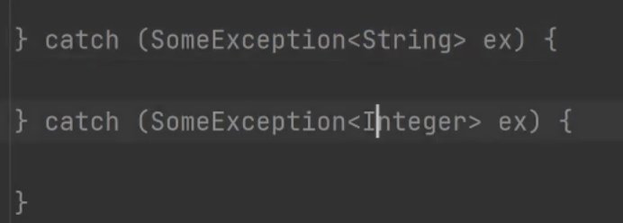

# Wildcards - продолжение Обобщения (Generic)

https://javarush.com/groups/posts/2324-wildcards-v-generics

Это очень важная фишка дженериков.

Давай рассмотрим пример:

```java
public class Main {

   public static void main(String[] args) {

      String str = new String("Test!");
      // никаких проблем
      Object obj = str;

      List<String> strings = new ArrayList<String>();
      // ошибка компиляции!
      List<Object> objects = strings;
   }

}
```
Что же тут происходит?

Мы видим две очень похожие ситуации.
1. В первой из них мы пытаемся привести объект String к типу Object.

   Никаких проблем с этим не возникает, все работает как надо.


2. Но вот во второй ситуации компилятор выдает ошибку.

   Хотя, казалось бы, мы делаем то же самое.

   Просто теперь мы используем коллекцию из нескольких объектов.


Но почему возникает ошибка?

Какая, по сути, разница — приводим мы один объект String к типу Object или 20 объектов?

Между объектом и коллекцией объектов есть важное различие

- если класс B является наследником класса А,
- то Collection< B > при этом — не наследник Collection< A >


Именно по этой причине мы не смогли привести наш List<String> к List< Object >.

- String является наследником Object,
- но List<String> не является наследником List< Object >.

Интуитивно это выглядит не очень логично.

Почему именно таким принципом руководствовались создатели языка?

___

Давай представим, что здесь компилятор не выдавал бы нам ошибку:

```java
List<String> strings = new ArrayList<String>();
List<Object> objects = strings;
```

В этом случае, мы бы могли, например, сделать следующее:

```java
objects.add(new Object());
String s = strings.get(0);
```

- поскольку компилятор не выдал нам ошибок
- и позволил создать ссылку List < Object > object на коллекцию строк strings
- можем добавить в strings не строку, а просто любой объект Object!

Таким образом, мы лишились гарантии того, что
- в нашей коллекции находятся только указанные в дженерике объекты String.
- то есть, мы потеряли главное преимущество дженериков — типобезопасность.


И раз компилятор позволил нам все это сделать,
- значит, мы получим ошибку только во время исполнения программы,
- что всегда намного хуже, чем ошибка компиляции.


___ 

Чтобы предотвратить такие ситуации, компилятор выдает нам ошибку:

```java
// ошибка компиляции
List<Object> objects = strings;
```

...и напоминает, что List<String> — не наследник List<Object>.

Это железное правило работы дженериков, и его нужно обязательно помнить при их использовании.

Поехали дальше.

___

Допустим, у нас есть небольшая иерархия классов:

```java
public class Animal {
   public void feed() {
      System.out.println("Animal.feed()");
   }
}

public class Pet extends Animal {
   public void call() {
      System.out.println("Pet.call()");
   }
}

public class Cat extends Pet {
   public void meow() {
      System.out.println("Cat.meow()");
   }
}

```

- Во главе иерархии стоят просто Животные: от них наследуются Домашние Животные.
- Домашние Животные делятся на 2 типа — Собаки и Кошки.

А теперь представь, что
- нам нужно создать простой метод iterateAnimals().
- Метод должен принимать коллекцию любых животных (Animal, Pet, Cat, Dog),
- перебирать все элементы, и каждый раз выводить что-нибудь в консоль.

Давай попробуем написать такой метод:

```java
public static void iterateAnimals(Collection<Animal> animals) {

   for(Animal animal: animals) {
      System.out.println("Еще один шаг в цикле пройден!");
   }

}
```

Казалось бы, задача решена!

Однако, как мы недавно выяснили,
- List< Cat >, List< Dog >
- или List<Pet> не являются наследниками List<Animal>!

Поэтому при попытке вызвать метод iterateAnimals() со списком котиков мы получим ошибку компилятора:

```java
import java.util.*;

public class Main3 {

   public static void iterateAnimals(Collection<Animal> animals) {
      for(Animal animal: animals) {
         System.out.println("Еще один шаг в цикле пройден!");
      }
   }

   public static void main(String[] args) {
      List<Cat> cats = new ArrayList<>();
      cats.add(new Cat());
      cats.add(new Cat());
      cats.add(new Cat());
      cats.add(new Cat());

      //ошибка компилятора!
      iterateAnimals(cats);
   }

}
```

Ситуация выглядит не очень хорошо для нас!
- Получается, нам придется писать отдельные методы для перебора всех видов животных?


На самом деле нет, не придется :)
- И в этом нам как раз помогут wildcards!
- Мы решим задачу в рамках одного простого метода, используя вот такую конструкцию:

```java
 public static void iterateAnimals(Collection<? extends Animal> animals) {

   for(Animal animal: animals) {
      System.out.println("Еще один шаг в цикле пройден!");
   }

}
```

Это и есть wildcard.
- Точнее, это первый из нескольких типов wildcard — “extends”
- (другое название — Upper Bounded Wildcards).

## Первый из нескольких типов wildcard — “extends”

О чем нам говорит эта конструкция?
- Это значит, что метод принимает на вход коллекцию объектов класса Animal
- либо объектов любого класса-наследника Animal (? extends Animal).

Иными словами, метод может принять на вход коллекцию Animal, Pet, Dog или Cat — без разницы.

Давай убедимся что это работает:

```java
public static void main(String[] args) {

   List<Animal> animals = new ArrayList<>();
   animals.add(new Animal());
   animals.add(new Animal());

   List<Pet> pets = new ArrayList<>();
   pets.add(new Pet());
   pets.add(new Pet());

   List<Cat> cats = new ArrayList<>();
   cats.add(new Cat());
   cats.add(new Cat());

   List<Dog> dogs = new ArrayList<>();
   dogs.add(new Dog());
   dogs.add(new Dog());

   iterateAnimals(animals);
   iterateAnimals(pets);
   iterateAnimals(cats);
   iterateAnimals(dogs);

}
```

Вывод в консоль:

```java
Еще один шаг в цикле пройден!
Еще один шаг в цикле пройден!
Еще один шаг в цикле пройден!
Еще один шаг в цикле пройден!
Еще один шаг в цикле пройден!
Еще один шаг в цикле пройден!
Еще один шаг в цикле пройден!
Еще один шаг в цикле пройден!
```

- мы создали в общей сложности 4 коллекции и 8 объектов,
- и в консоли ровно 8 записей. Все отлично работает!

Wildcard позволил нам
- легко уместить нужную логику с привязкой к конкретным типам в один метод.
- мы избавились от необходимости писать отдельный метод для каждого вида животных.
- представь, сколько методов у нас было бы, если бы наше приложение использовалось в зоопарке или ветеринарной клинике :)


А теперь давай рассмотрим другую ситуацию.
- наша иерархия наследования останется неизменной: класс верхнего уровня Animal,
- чуть ниже — класс домашних животных Pet,
- а на следующем уровне — Cat и Dog.

Теперь тебе нужно переписать метод iretateAnimals() таким образом,
чтобы он мог работать с любым типом животных, кроме собак.


То есть он должен принимать на вход
- Collection< Animal >,
- Collection< Pet >
- или Collection< Cat >,
- но не должен работать с Collection< Dog >.


Как мы можем этого добиться?

- Кажется, перед нами опять замаячила перспектива писать отдельный метод для каждого типа :/
- Как иначе объяснить компилятору нашу логику?

А сделать это можно очень просто!
- Здесь нам снова придут на помощь wildcards.
- Но на этот раз мы воспользуемся другим типом — “super” (другое название — Lower Bounded Wildcards).

## Второй из нескольких типов wildcard — “super”

```java
public static void iterateAnimals(Collection<? super Cat> animals) {

   for(int i = 0; i < animals.size(); i++) {
      System.out.println("Еще один шаг в цикле пройден!");
   }

}
```

Здесь принцип похож.

Конструкция <? super Cat> говорит компилятору,
- что метод iterateAnimals() может принимать на вход коллекцию объектов класса Cat
- либо любого другого класса-предка Cat.

Под это описание в нашем случае подходят
- сам класс Cat,
- его предок — Pets,
- и предок предка — Animal.

Класс Dog не вписывается в это ограничение,
- и поэтому попытка использовать метод со списком List<Dog>
- приведет к ошибке компиляции:

```java
public static void main(String[] args) {

   List<Animal> animals = new ArrayList<>();
   animals.add(new Animal());
   animals.add(new Animal());

   List<Pet> pets = new ArrayList<>();
   pets.add(new Pet());
   pets.add(new Pet());

   List<Cat> cats = new ArrayList<>();
   cats.add(new Cat());
   cats.add(new Cat());

   List<Dog> dogs = new ArrayList<>();
   dogs.add(new Dog());
   dogs.add(new Dog());

   iterateAnimals(animals);
   iterateAnimals(pets);
   iterateAnimals(cats);

   //ошибка компиляции!
   iterateAnimals(dogs);

}
```

Наша задача решена, и снова wildcards оказались крайне полезными :)


# Стирание типов

https://www.youtube.com/watch?v=pgzHglCsTcw

Изначально работа с ArrayList выглядела так:

Вот мы создали класс без указания типа:
```java
public class Main {

   public static void main(String[] args) {
      ArrayList list = new ArrayList<>();
   }

}
```
IDE нас предупреждает (подсказка при наведении), что это сырой класс:

      Raw use of parameterized class 'ArrayList'

      Необработанное использование параметризованного класса 'ArrayList'

Но этот код не является ошибкой, код компилируется

___

И как работать с этим классом?

Создадим какую-нибудь переменную и положим в список:

```java
public class Main {

   public static void main(String[] args) {
      ArrayList list = new ArrayList<>();
      String str = "Hello world";
      list.add(str);
      str = list.get(0); //не скомпилируется из-за Object:
   }

}
```

Функция add ожидает Object:


Метод get возвращает тип Object:



Если мы захотим значение из списка взять обратно,

То нужно сделать приведение типов:

```java
public class Main {

   public static void main(String[] args) {
      ArrayList list = new ArrayList<>();
      String str = "Hello world";
      list.add(str);
      str = (String) list.get(0);      //привидение типа
   }

}
```

- этот код будет работать нормально.
- вот так работало до появления Jenerics (до Java5)

Минусы:
- это неудобно, т.к. каждый раз когда хотим что-то извлечь из листа нам надо делать приведение типов
- а во вторых можно легко ошибиться, ведь мы можем записать в лист объект другого типа:

```java
public class Main {

   public static void main(String[] args) {
      ArrayList list = new ArrayList<>();
      String str = "Hello world";
      list.add(str);
      list.add(5);
      str = (String) list.get(1);
      System.out.println(str);
   }

}
```

Получим ошибку:
```java
ClassCastException
```

Потому что ожидали тип String, а там оказалось Integer

___

Выходит до появления Дженериков все было довольно плохо.

Поэтому очевидно, что создатели языка решили
добавить средства для обобщенного программирования


При создании Дженериков сделали так:
- чтобы код был совместим с пред версиями
- и в рез-те мы можем написать теперь:

```java
public class Main {

   public static void main(String[] args) {
      ArrayList list = new ArrayList<>();
      String str = "Hello world";
      list.add(str);
      list.add(5);
      str = (String) list.get(1);
      System.out.println(str);

      ArrayList<String> stringList = new ArrayList<>();
      ArrayList<Integer> integerList = new ArrayList<>();
      stringList.add(5);      //теперь компилятор не позволит совершить действие
   }

}
```

### Основной особенностью реализации Дженериков

Является то, что все эти типы существуют только на этапе компиляции:
```java
ArrayList<String> stringList = new ArrayList<>();       //<String>
ArrayList<Integer> integerList = new ArrayList<>();     //<Integer>
```

То есть:
- мы расставляем все типы
- чтобы не было проблем как описывали выше с листом String, куда кладем int
- компилятор проверяет, что все типы совпадают
- после чего он генерирует код, в котором уже никаких параметров нет
- ArrayList с параметрами превращаются в обычные сырые ArrayList без параметров
- компилятор автоматически расставляет приведение типов где нужно
- и не только
- в целом этот процесс называется "стирание типов"

Итак, стирание типов - это:
- процесс, когда при компиляции из обобщенных классов с параметрами
- генерируется код уже обычных сырых классов
- с расставлением где нужно преобразованием типов
- и других вещей (генерацией дополнительных методов и тп)

Собственно детали того, как этот процесс происходит знать необязательно.

Разработчику это ничем не поможет.

#### Главный основной тезис текущей темы:

Что дженерики существуют только для компилятора на этапе компиляции

Это главное, что нужно запомнить.

___

А теперь посмотрим к чему это приводит!
- тут будет ошибка компиляции:



- а тут будет все ок:
- но это потому что выполнение кода будет уже после компиляции, в runtime:




### Какие еще могут быть нюансы по стиранию типов?

#### Нюанс №1

```java
class TestClass1 <T> {

   private void handle(T operand) {
   }

   private void handle(Object obj) {
   }

}
```

- выше видим 2 метода
- первый после стирания типов станет аналогичным второму
- что приведет к проблеме, когда мы имеем два одинаковых метода

Нужно учесть, что если напишем Extends - ошибка исчезает:

```java
class TestClass1 <T extends Comparable<T>> {

   private void handle(T operand) {
   }

   private void handle(Object obj) {
   }

}

```

- Почему?
- Потому что стирание типов происходит всегда в левую границу.

Как это понять?

Вот у нас есть иерархия наследования:



- во главе всегда Object
- и от него может идти несколько уровней наследования
- и у нас есть два слова Extends и Super
- чтобы ограничить диапазон допустимых классов в этой иерархии


- если расположить иерархию так,
  что она будет идти сверху от класса Object вниз
- то Extends у нас будет задавать верхнюю границу
- а Super нижнюю:



Поэтому если мы пишем


```java
<T extends Comparable<T>>
```

- то T уже не будет стерто в Object
- а будет стерто в тот класс, который в Extends задан
- в нашем случае T превратится в Comparable
- и не будет конфликтовать с методом, который использует Object
- теперь у нас два разных параметра


___

#### Нюанс №2

Мы не можем использовать параметризированные Exception.



- т.к. пропадет допустим тип String и Integer
- поэтому SomeException станут одинаковыми
- соответственно в откомпилированной программе невозможно их различить

Поэтому:
- Exception не можем быть Дженериком
- это запрещено самим языком.


---


#### Нюанс №3

Когда нам например надо создать экземпляры типа < T >

```java
public static class AddTenList<T> {
   private ArrayList<T> list = new ArrayList<>();

   public AddTenList(ArrayList<T> list) {
      this.list = list;
      for (int i = 0; i < 10; i++) {
         list.add(new T());
      }
   }
}
```

- Проблема в том, что Тип < T > у нас будет стерт
- Поэтому мы не можем создать экземпляр класса Т
- Потому что в данном классе, после компиляции не останется достаточно информации, чтобы эту операцию выполнить


- а где есть информация?
- ...

НЕДООПИСАНО - ЗАПУТАНО В ПРИМЕРЕ
https://www.youtube.com/watch?v=pgzHglCsTcw
с 8:58 и до конца

Пока буду считать достаточно про стирание типов


