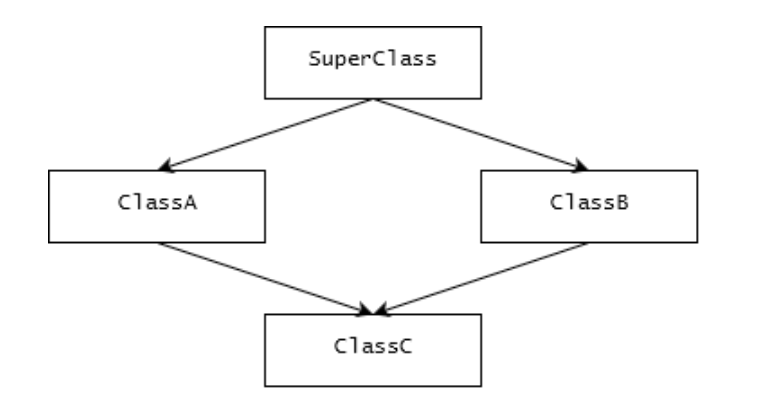
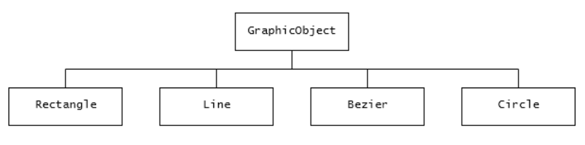

# Абстракция 

https://sky.pro/media/chto-takoe-abstraktnye-klassy/
https://sky.pro/media/princzip-abstrakczii-v-java-ot-abstraktnyh-klassov-k-interfejsam/

Абстракция в Java – это процесс скрытия деталей реализации 
и представления только функциональности. 

В простых словах, это способ создания простых моделей сложных систем:
- скрывая сложные детали 
- и выделяя необходимые функции.


### Абстрактные классы и интерфейсы – в чем разница? 🤔

В Java есть два основных способа создания абстракций:
- это абстрактные классы 
- и интерфейсы. 

Но в чем их разница?

🟠 Абстрактный класс – это класс, который:
- содержит один или более абстрактных методов, 
- которые объявлены, 
- но не имеют реализации (в идеале, надо смотреть по здравому смыслу, можно исп для уменьш дублирования)

Абстрактные классы:
- не могут быть использованы для создания объектов 
- и предназначены для наследования 
- и дальнейшей реализации в подклассах.


🟠 Интерфейс, с другой стороны, 
- это полностью абстрактный класс, 
- который может содержать только абстрактные методы.
- с Java 8, интерфейсы могут также содержать методы по умолчанию, которые уже имеют реализацию.


### Примеры абстракции в Java 👨‍💻

Давайте представим, что мы создаем систему для автомобилей. 

- мы могли бы создать абстрактный класс Car 
- с методами startEngine(), stopEngine(), accelerate() и brake(). 
- эти методы будут абстрактными, так как реализация этих методов будет различаться для разных типов автомобилей.

Теперь представьте, что у нас:
- есть классы ElectricCar и PetrolCar, 
- которые наследуют от класса Car 
- и реализуют все абстрактные методы в соответствии со своими спецификациями. 

Это иллюстрация применения абстракции в Java.


### Зачем нам абстракция? 🧐

- Абстракция помогает нам в управлении сложностью программы,
- упрощая сложные системы. 


- это позволяет нам сконцентрироваться на важных аспектах системы, 
- игнорируя нерелевантные детали. 


Таким образом:
- абстракция делает наши программы более понятными, 
- легко поддерживаемыми 
- и гибкими.


___

## Разберем по порядку:
## Что такое абстрактные классы в Java и чем они отличаются от интерфейсов

Абстрактные классы 
- почти как интерфейсы,
- но дают дополнительные возможности

В объектно-ориентированном программировании есть четыре основополагающих принципа: 
1. композиция
2. полиморфизм
3. наследование 
4. и делегация. 

Их нужно эффективно реализовывать в Java. 

- для этого есть специальные инструменты — абстрактные классы
- и любому программисту на Java нужно понимать, 
что это такое и как грамотно использовать эти инструменты.


## Абстрактные методы и классы

Абстрактный класс объявляется при описании класса: 
- добавляют оператора abstract перед оператором class;
- абстрактные классы Java нельзя инициализировать как объект, но от них можно наследоваться.

Пример объявления абстрактного класса:

```java
public abstract class GraphicObject {
// объявление полей
    
// объявление не абстрактных методов
    abstract void draw();
}
```

Следующий код выдаст ошибку компиляции:

```java
GraphicObject object = new GraphicObject();
```

Пример класса, наследующего от абстрактного класса:

```java
public class Circle extends GraphicObject {
    
    void draw() {
        System.out.println(“Нарисовали круг.”);
    }
    
}
```

Абстрактный метод Java 
- это метод, который объявлен, 
- но в нём не описана логика, то есть метод не реализован. 

В таком случае нет фигурных скобок, а после объявления метода сразу идет точка с запятой.

Например:

```java
abstract void moveTo(double deltaX, double deltaY);
```

___

- Абстрактный класс необязательно должен содержать абстрактные методы.
- Но если какие-то методы класса объявлены абстрактными, то и он должен быть таким.

Следующий код выдаст ошибку компиляции:

```java
public class GraphicObject {
    
    abstract void draw();

}
```

___

- если класс наследуется от абстрактного класса, 
- в нём нужно описать реализацию всех абстрактных методов родительского класса. 


- если же какие-то из абстрактных методов родителя не реализованы, 
- класс-наследник тоже должен быть абстрактным.


💡💡💡 
- методы интерфейсов, которые не объявлены статическими (оператор static) 
- или методами по умолчанию (оператор default), 
- тоже абстрактные.


- но задается это неявно: 
- чтобы уменьшить количество кода, обычно не пишут оператор abstract у методов интерфейса. 
- хотя добавить его можно — это не вызовет ошибки компиляции.


## Абстрактные классы и интерфейсы: сравнение

Абстрактные классы очень похожи на интерфейсы. 

- интерфейсы, как и абстрактные классы, нельзя инициализировать в объект, 
- и они могут содержать описание методов: с реализацией и без нее.


Но есть важные отличия. 
- В интерфейсах все поля по умолчанию публичные, статические и неизменяемые, 
- а методы могут быть только публичными.


- В абстрактном классе можно объявить нестатическое поле класса изменяемым и непубличным. 
- А методы абстрактного класса могут иметь все допустимые уровни доступа:


    - публичный (public);
    - приватный (private);
    - защищенный (protected);
    - на уровне пакета (package).


- Абстрактный класс может иметь внутреннее состояние с одинаковым кодом управления для всех его потомков.
- А правила доступа к логике абстрактного класса можно спроектировать более гибко.


Еще одно важное отличие абстрактного класса от интерфейса: 
- в Java можно наследовать только один абстрактный класс, 
- а интерфейсов реализовать множество.


## Когда использовать абстрактный класс, а когда — интерфейс

Используйте абстрактный класс, если к вашей задаче применимо одно или несколько условий:

- 🔸 Необходимо распределить некоторый общий код между несколькими тесно связанными классами.
- 🔸 У классов-наследников много общих полей и методов с уровнями доступа, отличными от публичного. 
- 🔸 У объекта класса какое-то внутреннее состояние. Это потребует объявления нестатических, изменяемых полей и методов доступа.


Используйте интерфейс, если к вашей задаче применимы утверждения:
- 🔹 Нужно объявить только контракт работы с каким-то типом данных
без каких-либо указаний на его внутреннее состояние. 
- 🔹 Объявленный контракт будет использоваться не только в связанных классах, 
  - но и в типах, которые напрямую не связаны с ним. 
  - или даже в коде за пределами текущего приложения или библиотеки. 
  - например, интерфейсы из стандартной библиотеки Java Comparable и Cloneable реализованы многими сторонними библиотеками.
- 🔹 Структура типа данных предполагает, что будет участвовать во множественном наследовании.


### Пример

В качестве примера абстрактного класса из стандартной библиотеки Java приведем класс AbstractMap. 

- У его наследников — HashMap, TreeMap и ConcurrentHashMap — много общих методов. 
- Например, get, put, isEmpty, containsKey и containsValue, которые изначально были объявлены в AbstractMap.


Пример класса, который реализует несколько интерфейсов, — класс HashMap. 
- Он реализует интерфейсы Serializable, Cloneable, и Map<K, V>. 
- Независимо от конкретной реализации этого класса он будет поддерживать клонирование, конвертацию в массив байтов. 
- А еще иметь функции таблицы: предоставлять доступ к внутренним данным по ключу.

Многие библиотеки используют абстрактный класс и интерфейсы одновременно. 
- Например, класс HashMap реализует несколько интерфейсов и наследует класс AbstractMap.


## Почему в Java нет множественного наследования классов

В объектно-ориентированных языках программирования множественным наследованием называется:
- возможность описать класс, 
- который наследуется от нескольких классов-родителей.

В отличие от других популярных ООП-языков, таких как C++, 
- Java не поддерживает множественное наследование, 
- так как оно вызывает проблему ромба — или, по-другому, проблему алмаза.

Проблема ромба:

Рассмотрим пример наследования, где дерево классов можно представить диаграммой:



Допустим, у нас есть:
- абстрактный класс SuperClass
- в нём объявлен метод, который реализуется классами-наследниками ClassA и ClassB:

SuperClass.java

```java
public abstract class SuperClass {
 
public abstract void doSomething();

}
```

ClassA.java

```java
public class ClassA extends SuperClass {
 
  @Override
  public void doSomething(){
    System.out.println("doSomething implementation of A");
  }
 
  //ClassA own method</code>
  public void methodA(){
      </code>
  }
  
}
```

ClassB.java

```java
public class ClassB extends SuperClass{
 
  @Override
  public void doSomething() {
    System.out.println("doSomething implementation of B");
  }
 
  //ClassB specific method
  public void methodB() {
  }
  
}
```

Теперь предположим, что при разрешенном множественном наследовании,

ClassC наследует оба класса: ClassA и ClassB.

```java
//Это гипотетический пример описания класса
//В реальном компиляторе Java данный код вызовет
//ошибку компиляции,
public class ClassC extends ClassA, ClassB{
 
public void test(){
    //calling super class method
    doSomething();
}
 
}
```

Заметьте, что метод test() вызывает родительский метод doSomething(). 

Это ведет к неопределенности: 
- мы не знаем, какой именно код будет выполнен в итоге
- так как метод doSomething() реализован и в ClassA, и в ClassB. 
- компилятору потребуются дополнительные инструкции, чтобы разрешить эту ситуацию. 

Это и называется проблемой ромба.


Мы рассмотрели простой пример, 
- но проблема ромба усугубляется, 
- если наследоваться от трех и более классов, которые реализуют один и тот же метод. 

У разработчиков Java был выбор: 
- простота языка 
- или дополнительные языковые конструкции для поддержки множественного наследования. 

Они выбрали первое. 
Поэтому в Java нет множественного наследования, но его можно реализовать самостоятельно. 

Например, с помощью паттерна программирования «композиция».


## Пример абстрактного класса

Рассмотрим пример приложения для рисования. 

Его создают по принципам объектно-ориентированного программирования. 

В коде приложения нужно:
- реализовать несколько классов, 
- которые описывают графические объекты. 

Например, 
- круг
- прямоугольник
- линию и кривую Безье.


У всех этих объектов должны быть общие атрибуты для описания состояния объекта:
- позиция относительно сетки координат;
- размер;
- ориентация; 
- цвета обводки 
- и цвет заполнения.


А еще методы для управления состоянием: 
- передвинуть, 
- повернуть, 
- изменить размер, 
- отрисовать.

___

Позиция, цвет заполнения и метод «передвинуть» 
- будут одинаковыми для всех графических объектов. 
- другие придется реализовывать отдельно для каждого объекта. 
- например, «изменить размер» и «отрисовать».


Все графические объекты должны уметь:
- менять размер 
- и отрисовывать себя, 
- но способы будут разные. 

Это идеальная ситуация, чтобы использовать абстрактный класс-родитель.

___

Воспользуемся преимуществами абстрактного класса 
- и реализуем все общие атрибуты 
- и методы в общем предке.

Назовем его GraphicObject. 
А всю различающуюся логику опишем в каждом классе-наследнике отдельно.

Структура дерева классов будет такая:



Сначала объявим класс GraphicObject, чтобы описать общие для всех потомков поля и методы:
- текущая позиция 
- и метод для ее изменения (moveTo). 

В классе GraphicObject тоже объявим абстрактные методы с уникальной реализацией для каждого потомка.

Например, методы draw or resize для отрисовки и изменения размера объекта соответственно. 

Код класса GraphicObject будет выглядеть примерно так:

```java
abstract class GraphicObject {
  int x, y;
  ...
  void moveTo(int newX, int newY) {
  ...
   
  abstract void draw();
  abstract void resize();
}
```

Все неабстрактные классы-потомки GraphicObject (Circle и Rectangle) должны содержать реализацию методов draw и resize. 

Их код будет выглядеть примерно так:

```java
class Circle extends GraphicObject {
  void draw() {
  ...
  }
  void resize() {
  ...
  }
}
```

```java
class Rectangle extends GraphicObject {
  void draw() {
  ...
  }
  void resize() {
  ...
  }
}
```

### Если абстрактный класс реализует интерфейс

Когда класс реализует интерфейс, в нём нужно имплементировать все методы интерфейса. 

- но если объявить такой класс абстрактным, 
- то некоторые или все методы можно не имплементировать. 

Вместо этого их можно реализовать через классы-наследники. 

Пример:

```java
interface Y {
 
  void methodA();
   
  void methodB();
  
}
```

```java
abstract class X implements Y {
 
@Override
void methodA() {
    System.out.println(“Inside method A in class X”);
  }
  
}
```

```java
class XX extends X {

  @Override
  void methodB() {
    System.out.println(“Inside method B in class XX”);
  }

}
```


В этом примере класс Х обязательно нужно
- бъявить абстрактным, потому что он реализует только один из методов интерфейса Y
- А класс ХХ, наследуя от класса Х, должен обязательно реализовать methodB().


## Члены класса

У абстрактного класса могут быть статические поля и методы. 

Доступ к таким членам класса получают через ссылку на класс. 

При этом не создается его экземпляр. Например:


```java
AbstractClass.staticMethod().
```

## Главное про разницу между интерфейсом и абстрактным классом

- Абстрактные классы похожи на интерфейсы, 
но в отличие от них поддерживают внутреннее состояние.
А методы абстрактного класса могут иметь уровень доступа, отличный от публичного.


- Абстрактные классы — важная часть парадигмы ООП, реализованной в Java. 
Как и абстрактные методы, их задают с помощью оператора abstract.


- Абстрактные классы могут не содержать абстрактные методы и реализовывать интерфейсы.


- Java не поддерживает множественное наследование, чтобы избежать проблемы ромба.


