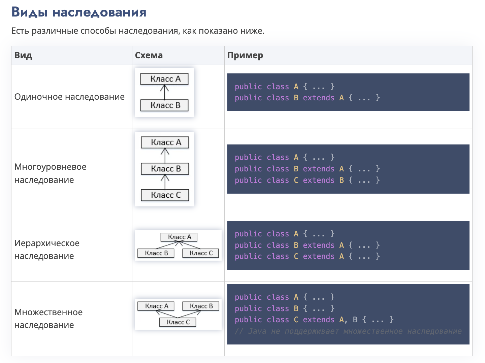

# Наследование

## Определение

Наследование — это процесс, 
когда один класс (дочерний класс) наследует свойства и методы
другого класса (родительского класса). 

Это позволяет создавать новые классы, используя уже существующие,
и это повышает уровень повторного использования кода. 
В результате, дочерний класс получает доступ
к всем полям (переменным) и методам родительского класса.


## Ключевое слово extends

В Java для создания наследования между классами
используется ключевое слово extends. 

extends – это кодовое слово, используемое для наследования
свойств класса. 

Взглянем на синтаксис этого ключевого слова:
```java
class Super {
   ...
}
class Sub extends Super {
   ...
}
```


________

Вот пример наследования в Java:

```java
class Parent {
    int a = 10;
 
    void display() {
        System.out.println("This is the parent class.");
    }
}
 
class Child extends Parent {
    int b = 20;
 
    void show() {
        System.out.println("This is the child class.");
    }
}
```

В данном примере класс Child наследует свойства 
и методы класса Parent. 

Теперь давайте разберемся, 
как использовать это наследование:

```java
public class Main {
    public static void main(String[] args) {
        Child obj = new Child();
        obj.display(); // вызываем метод родительского класса
        obj.show(); // вызываем метод дочернего класса
        System.out.println("Value of a: " + obj.a); // доступ к полю родительского класса
        System.out.println("Value of b: " + obj.b); // доступ к полю дочернего класса
    }
}
```

В данном примере мы видим, что с помощью объекта класса Child
мы можем обращаться к полям и методам как родительского, 
так и дочернего класса.


## Методы суперкласса и подкласса

Класс, который наследует свойства другого класса, 
называется подклассом (производным классом, наследующим классом).

А класс, свойства которого наследуются, 
известен как суперкласс (базовый класс, родительский класс).

____

Если в дочернем классе есть метод с тем же именем, 
что и в родительском классе, то метод дочернего класса
будет «переопределять» метод родительского класса. 

Однако, если требуется вызвать метод родительского класса 
из дочернего класса, можно использовать ключевое слово super. 

Вот пример:

```java
class Parent {
    void display() {
        System.out.println("This is the parent class method.");
    }
}
 
class Child extends Parent {
    void display() {
        System.out.println("This is the child class method.");
    }
 
    void callParentMethod() {
        super.display(); // вызываем метод родительского класса с помощью super
    }
}
 
public class Main {
    public static void main(String[] args) {
        Child obj = new Child();
        obj.display(); // вызывается метод дочернего класса
        obj.callParentMethod(); // вызывается метод родительского класса через метод дочернего класса
    }
}
```


## Ключевое слово super

Ключевое слово super схоже с ключевым словом this. 
Ниже приведены случаи, где используется super в Java.

1. Для дифференциации членов суперкласса от членов подкласса, если у них есть одинаковые имена.
2. Для вызова конструктора суперкласса из подкласса.

### 1. Дифференциация членов
Если класс перенимает свойства другого класса, и члены суперкласса имеют те же имена, что и в подклассе, для их разделения мы используем ключевое слово super, как показано ниже.

```java
super.variable
super.method();
```

Этот раздел содержит программу, которая демонстрирует использование ключевого слова super в Java.

В предложенной программе у вас есть два класса с именами 
Sub_class и Super_class, оба имеющие метод display() с разными 
реализациями и переменную с именем num с разными значениями. 

Вы можете увидеть, что мы использовали ключевое слово 
super для дифференциации членов суперкласса из подкласса.


```java
// Интерфейс
class Super_class {
   int num = 88;

   // Метод display() суперкласса
   public void display() {
      System.out.println("Это метод display() суперкласса");
   }
}

public class Sub_class extends Super_class {
   int num = 77;

   // Метод display() субкласса
   public void display() {
      System.out.println("Это метод display() подкласса");
   }

   public void my_method() {
      // Инициализация подкласса
      Sub_class sub = new Sub_class();

      // Вызываем метод display() подкласса
      sub.display();

      // Вызываем метод display() суперкласса
      super.display();

      // Выводим значение переменной num подкласса
      System.out.println("Значение переменной num в подклассе: " + sub.num);

      // Выводим значение переменной num суперкласса
      System.out.println("Значение переменной num в суперклассе: " + super.num);
   }

   public static void main(String args[]) {
      Sub_class obj = new Sub_class();
      obj.my_method();
   }
}
```

После запуска программы будет получен следующий результат:
```java
Это метод display() подкласса
Это метод display() суперкласса
Значение переменной num в подклассе: 77
Значение переменной num в суперклассе: 88
```

## Примечание:

Подкласс наследует все члены (поля, методы, вложенные классы)
из суперкласса.

В Java конструкторы не являются членами,
поэтому они не наследуются подклассом, но конструктор суперкласса
может быть вызван из подкласса.

## Вызов конструктора суперкласса

Если класс перенимает свойства другого класса, 
подкласс автоматически получается стандартный конструктор 
суперкласса. 

Но если Вы хотите вызвать параметризованный 
конструктор суперкласса, Вам нужно использовать 
ключевое слово super, как показано ниже.

```java
class Superclass {
   int age;

   Superclass(int age) {
      this.age = age; 		 
   }

   public void getAge() {
      System.out.println("Значение переменной age в суперклассе равно: " + age);
   }
}
```

```java
public class Subclass extends Superclass {
   Subclass(int age) {
      super(age);
   }

   public static void main(String args[]) {
      Subclass s = new Subclass(24);
      s.getAge();
   }
}
```

```java
Значение переменной age в суперклассе равно: 24
```


## Отношение IS-A

IS-A – это способ сказать «Этот объект является типом этого объекта». 

Давайте посмотрим, как ключевое слово extends используется для достижения наследования.

```java
public class Animal {
}

public class Mammal extends Animal {
}

public class Reptile extends Animal {
}

public class Dog extends Mammal {
}
```
Теперь, основываясь на примере выше, 
объектно-ориентированных терминах, следующие утверждения верны:

- Animal является суперклассом класса Mammal.
- Animal является суперклассом класса Reptile.
- Mammal и Reptile являются подклассами класса Animal.
- Dog одновременно является подклассом классов Mammal и Animal.

Теперь, используя отношение IS-A, мы можем сказать так:

- Mammal IS-A Animal.
- Reptile IS-A Animal.
- Dog IS-A Mammal. 
- Таким образом, Dog IS-A тоже Animal.

С использованием ключевого слова extend, 
подклассы могут наследовать все свойства суперкласса 
кроме его приватных свойств (private).

Мы можем убедиться, что Mammal на самом деле Animal 
с использованием оператора экземпляра.

```java
class Animal {
}

class Mammal extends Animal {
}

class Reptile extends Animal {
}

public class Dog extends Mammal {

    public static void main(String args[]) {
        Animal a = new Animal();
        Mammal m = new Mammal();
        Dog d = new Dog();

        System.out.println(m instanceof Animal);
        System.out.println(d instanceof Mammal);
        System.out.println(d instanceof Animal);
    }
}
```

```java
true
true
true
```

### implements (в интерфейсах)

Так как у нас есть хорошее понимание принципа работы ключевого
слова extends, давайте рассмотрим, как используется ключевое слово
implements для получения отношения IS-A.

В общем, ключевое слово implements в Java используется 
с классами для перенятия свойств интерфейса. 

Интерфейсы никогда не могут быть переняты классом с помощью extends.

```java
public interface Animal {
}

public class Mammal implements Animal {
}

public class Dog extends Mammal {
}
```


## Ключевое Слово instanceof

Давайте использует оператор instanceof в Java с целью проверки, 
являются ли Mammal и Dog на самом деле Animal.

```java
interface Animal{}

class Mammal implements Animal{}

public class Dog extends Mammal {

   public static void main(String args[]) {
      Mammal m = new Mammal();
      Dog d = new Dog();

      System.out.println(m instanceof Animal);
      System.out.println(d instanceof Mammal);
      System.out.println(d instanceof Animal);
   }
}
```

```java
true
true
true
```


## Отношение HAS-A

Эти отношения в основном основаны на обращении. 
Они определяют, является ли определенный класс HAS-A определенным случаем. 
Эта взаимосвязь помогает уменьшить дублирование кода, 
а также баги. 

Взглянем на пример.

```java
public class Vehicle{}

public class Speed{}

public class Van extends Vehicle {
    private Speed sp;
}
```

Мы видим, что у класса Van HAS-A (есть) Speed. 
Имея отдельный класс Speed, нам не нужно вставлять код, 
принадлежащий Speed в класс Van, что позволяет нам использовать 
класс Speed в нескольких приложениях.

В особенности объектно-ориентированного программирования, 
пользователям не нужно волноваться о том, какой объект выполняет 
текущую работу. Для достижения этого, класс Van скрывает детали 
реализации от пользователей класса Van. Таким образом, пользователи, 
должны попросить класс Van выполнить определенное действие, 
и класс Van либо выполнит работу сам по себе, либо попросит 
другой класс выполнить действие.

//ЧТО-ТО ЗАПУТАНО И НЕ СОВСЕМ ПОНЯТНО, НАДЕЮСЬ, ПОКА МНЕ ЭТО НЕ НУЖНО :DD 


## Виды наследования

Есть различные способы наследования, как показано ниже.

- Одиночное наследование
- Многоуровневое наследование
- Иерархическое наследование
- Множественное наследование




Очень важно запомнить, что Java не поддерживает множественное наследование. 
Это значит, что класс не может продлить более одного класса. 
Значит, следующее утверждение НЕВЕРНО:

```java
public class extends Animal, Mammal{} 
```

Тем не менее, класс может реализовать один или несколько интерфейсов, 
что и помогло Java избавиться от невозможности множественного наследования.


## Заключение
Наследование в Java позволяет повысить уровень повторного
использования кода и упростить разработку программного обеспечения. 

Оно является важным принципом объектно-ориентированного программирования
и используется во многих различных языках программирования.


______
______
______

## Вопросы

вот тут не понял:

1. https://proglang.su/java/inheritance

Обращаясь к программе выше, 
Вы можете создать экземпляр класса, как в примере ниже. 

Но, используя ссылочную переменную суперкласса, 
Вы не можете вызвать метод multiplication(), 
который принадлежит подклассу My_Calculator.

```java
Calculator cal = new My_Calculator();
cal.addition(a, b);
cal.subtraction(a, b);
```

как осознать:

Calculator cal = new My_Calculator();

мне непонятна левая и правая часть
разница и в каком случае мы так делаем


2. 
